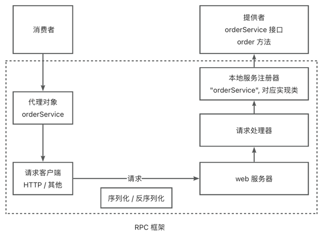

# Zun-RPC

基于 Spring Boot Starter 的轻量级 RPC 框架，支持自定义 TCP 协议、Etcd 服务注册发现、多种序列化方式、负载均衡及容错重试机制。

## 架构图



## 特性

- **Spring Boot 集成** — 通过 `@EnableZunRpc` 注解一键启用，`@ZunRpcService` / `@ZunRpcReference` 声明式使用
- **自定义 TCP 协议** — 17 字节定长协议头，支持多种序列化格式
- **SPI 可扩展** — 序列化器、注册中心、负载均衡器、重试/容错策略均可通过 SPI 扩展替换
- **Etcd 注册中心** — 基于 Lease 的服务注册，支持 Watch 服务变更、心跳续期、优雅下线
- **负载均衡** — 随机、轮询、一致性哈希
- **容错重试** — 支持不重试/固定间隔重试，以及快速失败/安全失败/失败自动恢复/失败自动切换容错策略

## 项目结构

```
zun-rpc
├── zun-rpc-spring-boot-starter    # RPC 框架核心（Spring Boot Starter）
├── example-common                  # 示例 - 公共接口与模型
├── example-spring-boot-provider    # 示例 - 服务提供者
└── example-spring-boot-consumer    # 示例 - 服务消费者
```

## 快速开始

### 环境要求

- JDK 11+
- Maven 3.6+
- Etcd（用于服务注册发现）

### 1. 引入依赖

在服务提供者和消费者的 `pom.xml` 中引入：

```xml
<dependency>
    <groupId>com.zunf</groupId>
    <artifactId>zun-rpc-spring-boot-starter</artifactId>
    <version>0.0.1-SNAPSHOT</version>
</dependency>
```

### 2. 定义公共接口

在公共模块中定义服务接口和模型类（需实现 `Serializable`）：

```java
// model
@Data
public class User implements Serializable {
    private String name;
    private Integer age;
}

// service interface
public interface UserService {
    User getUser(String name);
}
```

### 3. 服务提供者

启动类添加 `@EnableZunRpc` 注解，服务实现类添加 `@ZunRpcService` 注解：

```java
@EnableZunRpc
@SpringBootApplication
public class ProviderApplication {
    public static void main(String[] args) {
        SpringApplication.run(ProviderApplication.class, args);
    }
}

@ZunRpcService
public class UserServiceImpl implements UserService {
    @Override
    public User getUser(String name) {
        return new User(name, 38);
    }
}
```

`application.yaml` 配置：

```yaml
zun:
  rpc:
    application: my-provider
    version: 1.0
    serializer: jdk
    registry:
      type: etcd
      address: http://localhost:2380
```

### 4. 服务消费者

启动类添加 `@EnableZunRpc` 注解，使用 `@ZunRpcReference` 注入远程服务代理：

```java
@EnableZunRpc
@SpringBootApplication
public class ConsumerApplication {
    public static void main(String[] args) {
        SpringApplication.run(ConsumerApplication.class, args);
    }
}

@RestController
public class TestController {

    @ZunRpcReference
    private UserService userService;

    @GetMapping("/test")
    public String test() {
        return userService.getUser("zunf").toString();
    }
}
```

`application.yaml` 配置：

```yaml
zun:
  rpc:
    server-host: http://localhost
    serializer: jdk
    load-balancer: random
    retry-strategy: fixedInterval
    tolerance-strategy: failOver
    registry:
      type: etcd
      address: http://localhost:2380
```

### 5. 构建运行

```bash
# 构建全部模块
mvn clean package

# 启动 Etcd（Docker）
docker run -d -p 2379:2379 -p 2380:2380 quay.io/coreos/etcd:v3.5.0 etcd -advertise-client-urls http://0.0.0.0:2379 -listen-client-urls http://0.0.0.0:2379

# 先启动 Provider，再启动 Consumer
mvn spring-boot:run -pl example-spring-boot-provider
mvn spring-boot:run -pl example-spring-boot-consumer
```

## 配置项

| 配置项 | 说明 | 可选值 |
|--------|------|--------|
| `zun.rpc.serializer` | 序列化方式 | `jdk` `json` `hessian` `kryo` |
| `zun.rpc.load-balancer` | 负载均衡策略 | `random` `roundRobin` `consistentHash` |
| `zun.rpc.retry-strategy` | 重试策略 | `noRetry` `fixedInterval` |
| `zun.rpc.tolerance-strategy` | 容错策略 | `failFast` `failSafe` `failBack` `failOver` |
| `zun.rpc.registry.type` | 注册中心类型 | `etcd` |
| `zun.rpc.registry.address` | 注册中心地址 | Etcd 地址，如 `http://localhost:2380` |

## SPI 扩展

框架各核心组件均支持通过 SPI 机制扩展。在项目的 `resources/META-INF/rpc/custom/` 目录下创建以接口全限定名命名的文件，写入实现类映射即可覆盖默认实现：

```
# resources/META-INF/rpc/custom/com.zunf.rpc.serializer.Serializer
mySerializer=com.example.MySerializer
```

支持的 SPI 扩展点：

- `com.zunf.rpc.serializer.Serializer` — 序列化器
- `com.zunf.rpc.registry.Registry` — 注册中心
- `com.zunf.rpc.loadbalancer.LoadBalancer` — 负载均衡器
- `com.zunf.rpc.fault.retry.RetryStrategy` — 重试策略
- `com.zunf.rpc.fault.tolerance.ToleranceStrategy` — 容错策略

## 技术栈

- Java 11 / Spring Boot 2.6.13
- Vert.x 4.5（TCP/HTTP 通信）
- Etcd jetcd 0.7.7（服务注册发现）
- Jackson / Hessian / Kryo（序列化）
- Lombok / Hutool
