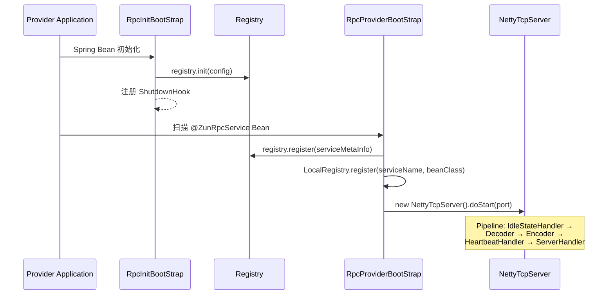
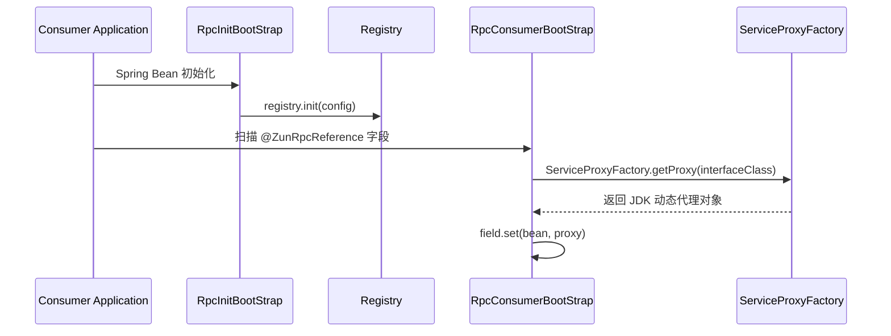
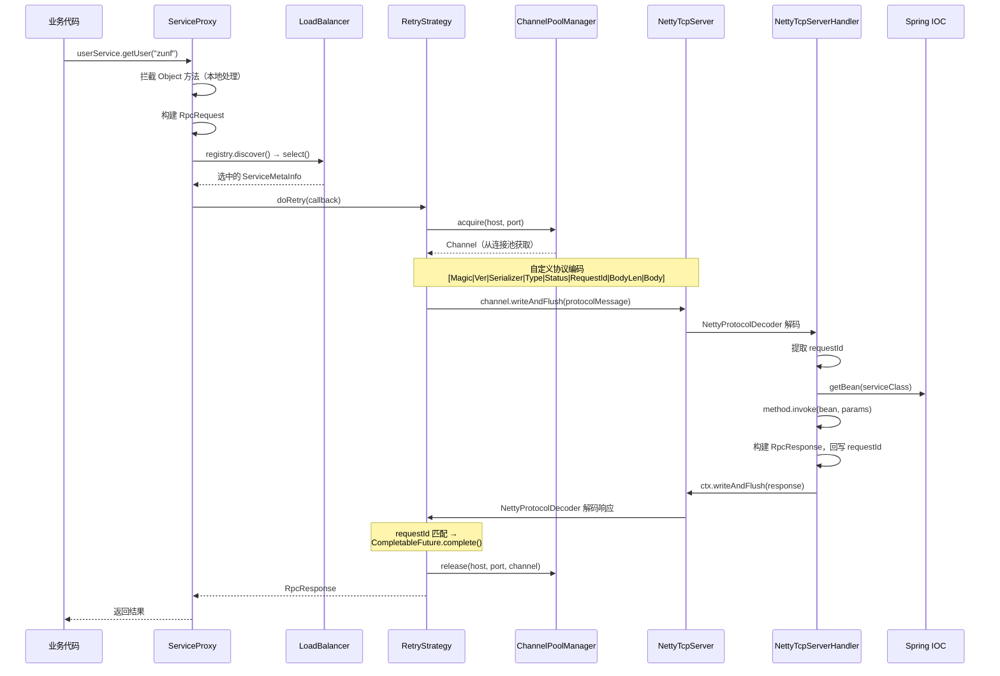
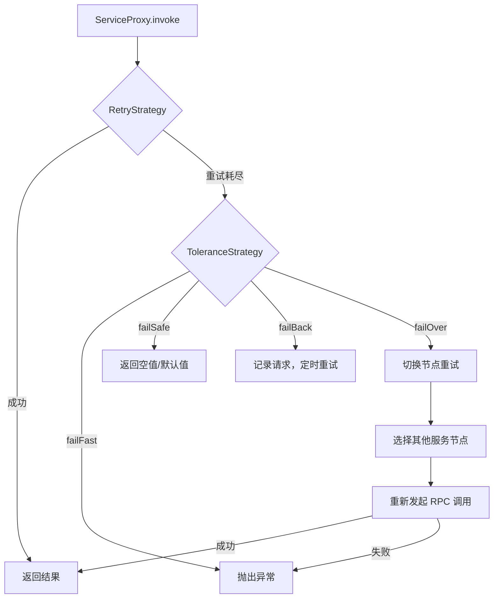
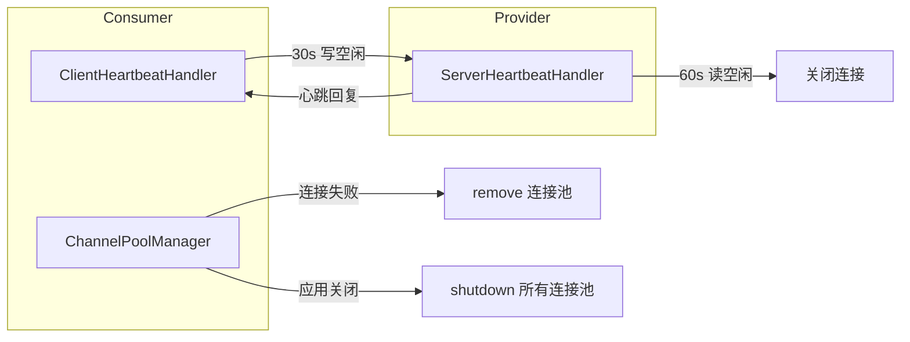

# Zun-RPC

基于 Spring Boot Starter 的轻量级 RPC 框架，支持自定义 TCP 协议、Netty 连接池复用、Etcd 服务注册发现（或直连模式）、多种序列化方式、负载均衡及容错重试机制。

## 架构图


## 特性

- **Spring Boot 集成** — 通过 `@EnableZunRpcProvider` / `@EnableZunRpcConsumer` 注解按需启用，`@ZunRpcService` / `@ZunRpcReference` 声明式使用
- **自定义 TCP 协议** — 17 字节定长协议头，支持多种序列化格式
- **Netty 通信层** — 基于 Netty 实现 TCP 通信，内置连接池复用、requestId 多路复用、心跳保活机制
- **可扩展** — 序列化器、注册中心、负载均衡器、重试/容错策略均可通过 `@Bean` 替换默认实现
- **注册中心** — 支持 Etcd（Watch 服务变更、心跳续期、优雅下线）和直连模式（无需注册中心）
- **负载均衡** — 随机、轮询、一致性哈希
- **容错重试** — 支持不重试/固定间隔重试，以及快速失败/安全失败/失败自动恢复/失败自动切换容错策略

## 项目结构

```
zun-rpc
├── zun-rpc-spring-boot-starter    # RPC 框架核心（Spring Boot Starter）
├── example-common                  # 示例 - 公共接口与模型
├── example-spring-boot-provider    # 示例 - 服务提供者
└── example-spring-boot-consumer    # 示例 - 服务消费者
```

## 调用流程

### Provider 启动流程


```mermaid
sequenceDiagram
    participant App as Provider Application
    participant Init as RpcInitBootStrap
    participant Reg as Registry
    participant Prov as RpcProviderBootStrap
    participant Server as NettyTcpServer

    App->>Init: Spring Bean 初始化
    Init->>Reg: registry.init(config)
    Init-->>Init: 注册 ShutdownHook

    App->>Prov: 扫描 @ZunRpcService Bean
    Prov->>Reg: registry.register(serviceMetaInfo)
    Prov->>Prov: LocalRegistry.register(serviceName, beanClass)
    Prov->>Server: new NettyTcpServer().doStart(port)
    Note over Server: Pipeline: IdleStateHandler →<br/>Decoder → Encoder →<br/>HeartbeatHandler → ServerHandler
```

### Consumer 启动流程


```mermaid
sequenceDiagram
    participant App as Consumer Application
    participant Init as RpcInitBootStrap
    participant Reg as Registry
    participant Cons as RpcConsumerBootStrap
    participant Factory as ServiceProxyFactory

    App->>Init: Spring Bean 初始化
    Init->>Reg: registry.init(config)

    App->>Cons: 扫描 @ZunRpcReference 字段
    Cons->>Factory: ServiceProxyFactory.getProxy(interfaceClass)
    Factory-->>Cons: 返回 JDK 动态代理对象
    Cons->>Cons: field.set(bean, proxy)
```

### RPC 调用流程


```mermaid
sequenceDiagram
    participant Caller as 业务代码
    participant Proxy as ServiceProxy
    participant LB as LoadBalancer
    participant Retry as RetryStrategy
    participant Pool as ChannelPoolManager
    participant Server as NettyTcpServer
    participant Handler as NettyTcpServerHandler
    participant IOC as Spring IOC

    Caller->>Proxy: userService.getUser("zunf")
    Proxy->>Proxy: 拦截 Object 方法（本地处理）
    Proxy->>Proxy: 构建 RpcRequest
    Proxy->>LB: registry.discover() → select()
    LB-->>Proxy: 选中的 ServiceMetaInfo

    Proxy->>Retry: doRetry(callback)
    Retry->>Pool: acquire(host, port)
    Pool-->>Retry: Channel（从连接池获取）

    Note over Retry,Server: 自定义协议编码<br/>[Magic|Ver|Serializer|Type|Status|RequestId|BodyLen|Body]

    Retry->>Server: channel.writeAndFlush(protocolMessage)
    Server->>Handler: NettyProtocolDecoder 解码
    Handler->>Handler: 提取 requestId
    Handler->>IOC: getBean(serviceClass)
    Handler->>Handler: method.invoke(bean, params)
    Handler->>Handler: 构建 RpcResponse，回写 requestId
    Handler->>Server: ctx.writeAndFlush(response)
    Server->>Retry: NettyProtocolDecoder 解码响应

    Note over Retry: requestId 匹配 →<br/>CompletableFuture.complete()

    Retry->>Pool: release(host, port, channel)
    Retry-->>Proxy: RpcResponse
    Proxy-->>Caller: 返回结果
```

### 容错流程


```mermaid
flowchart TD
    A[ServiceProxy.invoke] --> B{RetryStrategy}
    B -->|成功| C[返回结果]
    B -->|重试耗尽| D{ToleranceStrategy}

    D -->|failFast| E[抛出异常]
    D -->|failSafe| F[返回空值/默认值]
    D -->|failBack| G[记录请求，定时重试]
    D -->|failOver| H[切换节点重试]

    H --> I[选择其他服务节点]
    I --> J[重新发起 RPC 调用]
    J -->|成功| C
    J -->|失败| E
```

### 心跳与连接管理


```mermaid
flowchart LR
    subgraph Client[Consumer]
        CH[ClientHeartbeatHandler]
        CP[ChannelPoolManager]
    end

    subgraph Server[Provider]
        SH[ServerHeartbeatHandler]
    end

    CH -->|30s 写空闲| SH
    SH -->|心跳回复| CH
    SH -->|60s 读空闲| D[关闭连接]

    CP -->|连接失败| R[remove 连接池]
    CP -->|应用关闭| S[shutdown 所有连接池]
```

### 自定义协议格式


```mermaid
block-beta
    columns 7
    Magic:1 Version:1 Serializer:1 Type:1 Status:1 RequestId:8 BodyLength:4

    block:header:7
        columns 7
        M["Magic\n1 byte"] V["Version\n1 byte"] S["Serializer\n1 byte"] T["Type\n1 byte"] St["Status\n1 byte"] Rid["RequestId\n8 bytes"] Bl["BodyLength\n4 bytes"]
    end

    block:body:7
        columns 7
        B["Body (序列化后的请求/响应对象)"]
    end

    style header fill:#e1f5fe
    style body fill:#fff3e0
```

| 字段 | 长度 | 说明 |
|------|------|------|
| Magic | 1 byte | 魔数 `0x11` |
| Version | 1 byte | 协议版本 `1` |
| Serializer | 1 byte | 序列化器类型：1=JDK, 2=Kryo, 3=JSON, 4=Hessian |
| Type | 1 byte | 消息类型：1=REQUEST, 2=RESPONSE, 3=HEARTBEAT |
| Status | 1 byte | 状态：1=OK, 2=REQUEST_FAILED, 3=RESPONSE_FAILED |
| RequestId | 8 bytes | 雪花算法 ID，用于请求-响应多路复用匹配 |
| BodyLength | 4 bytes | Body 字节数 |
| Body | N bytes | 序列化后的 RpcRequest / RpcResponse |

## 快速开始

### 环境要求

- JDK 11+
- Maven 3.6+

### 1. 引入依赖

在服务提供者和消费者的 `pom.xml` 中引入：

```xml
<dependency>
    <groupId>com.zunf</groupId>
    <artifactId>zun-rpc-spring-boot-starter</artifactId>
    <version>0.0.1-SNAPSHOT</version>
</dependency>
```

### 2. 定义公共接口

在公共模块中定义服务接口和模型类（需实现 `Serializable`）：

```java
// model
@Data
public class User implements Serializable {
    private String name;
    private Integer age;
}

// service interface
public interface UserService {
    User getUser(String name);
}
```

### 3. 服务提供者

启动类添加 `@EnableZunRpcProvider` 注解，服务实现类添加 `@ZunRpcService` 注解：

```java
@EnableZunRpcProvider
@SpringBootApplication
public class ProviderApplication {
    public static void main(String[] args) {
        SpringApplication.run(ProviderApplication.class, args);
    }
}

@ZunRpcService
public class UserServiceImpl implements UserService {
    @Override
    public User getUser(String name) {
        return new User(name, 38);
    }
}
```

`application.yaml` 配置：

```yaml
zun:
  rpc:
    application: my-provider
    version: 1.0
    server-port: 10880
    server-host: localhost
    registry:
      type: etcd
      address: http://localhost:2380
```

如需自定义序列化器等组件，通过 `@Bean` 注册（见下方 [自定义扩展](#自定义扩展)）。

### 4. 服务消费者

启动类添加 `@EnableZunRpcConsumer` 注解，使用 `@ZunRpcReference` 注入远程服务代理：

```java
@EnableZunRpcConsumer
@SpringBootApplication
public class ConsumerApplication {
    public static void main(String[] args) {
        SpringApplication.run(ConsumerApplication.class, args);
    }
}

@RestController
public class TestController {

    @ZunRpcReference
    private UserService userService;

    @GetMapping("/test")
    public String test() {
        return userService.getUser("zunf").toString();
    }
}
```

`application.yaml` 配置：

```yaml
zun:
  rpc:
    server-host: localhost
    registry:
      type: etcd
      address: http://localhost:2380
```

如需自定义序列化器、负载均衡等组件，通过 `@Bean` 注册（见下方 [自定义扩展](#自定义扩展)）。

### 5. 构建运行

```bash
# 构建全部模块
mvn clean package -DskipTests

# 启动 Etcd（Docker）— 仅 Etcd 模式需要
docker run -d -p 2379:2379 -p 2380:2380 quay.io/coreos/etcd:v3.5.0 \
  etcd -advertise-client-urls http://0.0.0.0:2379 -listen-client-urls http://0.0.0.0:2379

# 先启动 Provider，再启动 Consumer
mvn spring-boot:run -pl example-spring-boot-provider
mvn spring-boot:run -pl example-spring-boot-consumer
```

## 直连模式

无需注册中心，Consumer 直接连接 Provider。配置方式：

```yaml
zun:
  rpc:
    registry:
      type: direct
      address: localhost:10880
```

适用于开发测试或固定地址场景。

## 配置项

| 配置项 | 说明 | 默认值 |
|--------|------|--------|
| `zun.rpc.server-port` | Provider 监听端口 | `10880` |
| `zun.rpc.server-host` | Provider 地址（Consumer 侧） | `localhost` |
| `zun.rpc.is-mock` | 是否使用模拟数据（Consumer 侧） | `false` |
| `zun.rpc.application` | Provider 应用名 | - |
| `zun.rpc.version` | Provider 版本号 | `1.0` |
| `zun.rpc.registry.type` | 注册中心类型（`etcd` / `direct`） | - |
| `zun.rpc.registry.address` | 注册中心地址 | - |
| `zun.rpc.registry.timeout` | 注册中心超时时间（毫秒） | `10000` |

## 自定义扩展

框架各核心组件均通过 `@Bean` + `@ConditionalOnMissingBean` 注册，只需在项目中定义同类型的 `@Bean` 即可覆盖默认实现：

```java
@Configuration
public class MyRpcConfig {

    // 替换默认的 JDK 序列化器为 Kryo
    @Bean
    public Serializer serializer() {
        return new KryoSerializer();
    }

    // 替换默认的直连注册中心为 Etcd
    @Bean
    public Registry registry() {
        return new EtcdRegistry();
    }

    // 替换默认的轮询负载均衡为随机
    @Bean
    public LoadBalancer loadBalancer() {
        return new RandomLoadBalancer();
    }

    // 替换默认的不重试为固定间隔重试
    @Bean
    public RetryStrategy retryStrategy() {
        return new FixedIntervalRetryStrategy();
    }

    // 替换默认的快速失败为失败自动切换
    @Bean
    public ToleranceStrategy toleranceStrategy() {
        return new FailOverToleranceStrategy();
    }
}
```

支持替换的组件及默认值：

| 组件 | 接口 | 默认实现 |
|------|------|----------|
| 序列化器 | `Serializer` | `JdkSerializer` |
| 注册中心 | `Registry` | `DirectRegistry` |
| 负载均衡器 | `LoadBalancer` | `RoundRobinLoadBalancer` |
| 重试策略 | `RetryStrategy` | `NoRetryStrategy` |
| 容错策略 | `ToleranceStrategy` | `FailFastToleranceStrategy` |

自定义序列化器时，需要实现 `Serializer` 接口并返回对应的 `SerializerEnums` 类型标识，用于协议头的序列化器标记：

```java
public class MyCustomSerializer implements Serializer {

    @Override
    public SerializerEnums getType() {
        return SerializerEnums.KRYO;  // 复用已有枚举或自定义
    }

    @Override
    public <T> byte[] serialize(T object) throws IOException {
        // ...
    }

    @Override
    public <T> T deserialize(byte[] bytes, Class<T> type) throws IOException {
        // ...
    }
}
```

## 序列化方式对比

| 序列化器 | 跨语言 | 性能 | 体积 | 安全性 | 适用场景 |
|----------|--------|------|------|--------|----------|
| **JDK** | 仅 Java | 慢 | 大 | 低（存在反序列化漏洞） | 快速验证、无需额外依赖 |
| **Kryo** | 仅 Java | 快 | 小 | 中（需关闭注册限制） | Java 纯内网高性能场景 |
| **JSON** (Jackson) | 支持 | 中 | 大 | 高（纯文本可审计） | 跨语言、调试友好、需要可读性 |
| **Hessian** | 支持 | 中 | 中 | 中 | 跨语言、二进制但可读 |

## 技术栈

- Java 11 / Spring Boot 2.6.13
- Netty 4.1（TCP 通信、连接池、心跳）
- Etcd jetcd 0.7.7（服务注册发现）
- Jackson / Hessian / Kryo（序列化）
- Lombok / Hutool
