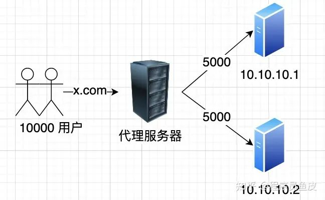
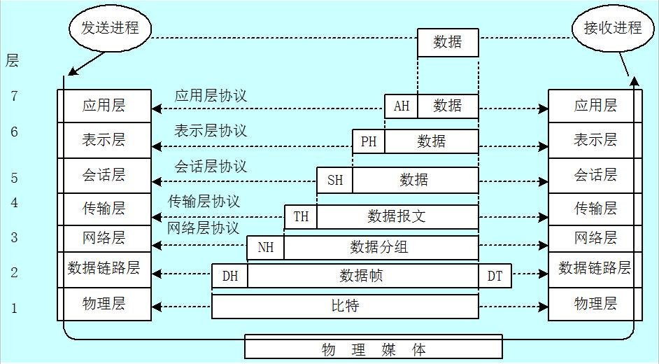

# 手写RPC框架

**项目目录：**

```c
|
|----- example-common 存储通用对象
|
|----- example-consumer 服务消费者-测试RPC框架V1.0、V2.0
|
|----- example-provider 服务提供者-测试RPC框架V1.0、V2.0
|
|----- example-spring-boot-consumer 服务消费者-测试RPC框架V2.1
|
|----- example-spring-boot-provider 服务提供者-测试RPC框架V2.1
|
|--------------------------- 下面是RPC框架迭代 ------------------------------
|
|----- zun-rpc-core RPC框架 V2.0，具有本RPC框架的所有功能
|
|----- zun-rpc-easy RPC框架 V1.0，最初的一版RPC框架，只是跑通流程
|
|----- zun-rpc-spring-boot-starter RPC框架 V2.1，在V2.0的基础上进行了优化，并且集成了SpringBoot框架

```


## RPC框架架构图


## 一、服务消费者、提供者定义

### 1.1 提供者
1. 定义UserService接口的具体方法实现
2. 启动web服务器，这里使用Vertx，也可以使用Tomcat
   - Web服务器的作用是接收http请求，并根据body中的信息从注册器中获取Service实现类，调用其中的方法，并封装方法调用的返回值，最后响应HTTP请求
```java
public class ProviderMain {

    public static void main(String[] args) {

        //服务启动时将服务注册到注册器中
        LocalRegistry.register(UserService.class.getName(), UserServiceImpl.class);

        VertxHttpServer vertxHttpServer = new VertxHttpServer();

        vertxHttpServer.doStart(8088);

    }
}
```

### 1.2 消费者
1. 消费者正常调用方法，如同调用本地方法一样即可，但要注意，Service接口要放在common包中，被消费者和提供者共用
```java
public class ConsumerMain {
    public static void main(String[] args) {

        //获取UserServiceImpl示例
        UserService userService = ServiceProxyFactory.getProxy(UserService.class);

        User user = userService.getUser("ZunF");
        if (user == null) {
            System.out.println("user == null");
        } else {
            System.out.println(user);
        }
    }
}
```
## 二、RPC框架
### 2.1 序列化器
代理对象和Web服务器之间的交互，其中的数据需要先进行序列化（转化为byte数组），才能够在网络上传输。
#### 2.1.1 序列化器接口
```java
 public interface Serializer {

    /**
     * 序列化
     * @param object 需要序列化的对象
     * @return 序列化结果
     * @param <T> 需要进行序列化的类
     * @throws IOException IO异常
     */
    <T> byte[] serialize(T object) throws IOException;


    /**
     * 反序列化
     * @param bytes 序列化byte数组
     * @param type 反序列化的目标类Class对象
     * @return 反序列化的结果
     * @param <T> 反序列化的目标类型
     * @throws IOException IO异常
     */
    <T> T deserialize(byte[] bytes, Class<T> type) throws IOException;
}
```
#### 2.1.2 Jdk序列化器
```java
public class JdkSerializer implements Serializer {
    /**
     * 序列化
     *
     * @param object 需要序列化的对象
     * @param <T>    需要进行序列化的类，注意，这个类需要实现Serializable接口
     * @return 序列化结果
     * @throws IOException IO异常
     */
    @Override
    public <T> byte[] serialize(T object) throws IOException {
        ByteArrayOutputStream byteArrayOutputStream = new ByteArrayOutputStream();
        ObjectOutputStream objectOutputStream = new ObjectOutputStream(byteArrayOutputStream);
        objectOutputStream.writeObject(object);
        objectOutputStream.close();
        return byteArrayOutputStream.toByteArray();
    }

    /**
     * 反序列化
     *
     * @param bytes 序列化byte数组
     * @param type  反序列化的目标类Class对象
     * @param <T>   反序列化的目标类型，注意，这个类需要实现Serializable接口
     * @return 反序列化的结果
     * @throws IOException IO异常
     */
    @Override
    public <T> T deserialize(byte[] bytes, Class<T> type) throws IOException {
        ByteArrayInputStream byteArrayInputStream = new ByteArrayInputStream(bytes);
        ObjectInputStream objectInputStream = new ObjectInputStream(byteArrayInputStream);
        try {
            return (T) objectInputStream.readObject();
        } catch (Exception e) {
            throw new RuntimeException(e);
        } finally {
            objectInputStream.close();
        }
    }
}
```

### 2.2 Web服务器
用于服务提供者启动，接收请求
```java
public class VertxHttpServer implements HttpServer {
    @Override
    public void doStart(int port) {
        //创建 Vert.x 实例
        Vertx vertx = Vertx.vertx();

        //创建 HTTP 服务器
        io.vertx.core.http.HttpServer server = vertx.createHttpServer();

        //设置请求的处理器
        server.requestHandler(new VertxHttpServerHandler());

        //启动 HTTP 服务器并监听指定端口
        server.listen(port, result -> {
            if (result.succeeded()) {
                System.out.println("Server is now listening on port " + port);
            } else {
                System.out.println("Failed to start server: " + result.cause());
            }
        });
    }
}
```

### 2.3 代理工厂、代理类
用于创建代理对象，向Web服务器发送网络请求，调用服务提供者的代码，并处理方法返回值，让用户无感地远程调用方法
#### 2.3.1 代理工厂
```java
public class ServiceProxyFactory {


    public static <T> T getProxy(Class<T> clazz) {
        return (T) Proxy.newProxyInstance(clazz.getClassLoader(), new Class[]{clazz}, new ServiceProxy());
    }

}
```

#### 2.3.2 代理类
```java
public class ServiceProxy implements InvocationHandler {


    @Override
    public Object invoke(Object proxy, Method method, Object[] args) throws Throwable {

        Serializer serializer = new JdkSerializer();

        //构造请求参数
        RpcRequest request = RpcRequest.builder()
                .serviceName(method.getDeclaringClass().getName())
                .methodName(method.getName())
                .paramTypes(method.getParameterTypes())
                .params(args)
                .build();

        try {
            byte[] bytes = serializer.serialize(request);
            //发送请求
            try (HttpResponse httpResponse = HttpRequest
                    .post("http://localhost:8088")
                    .body(bytes).execute()){

                //处理接口执行结果并返回
                byte[] result = httpResponse.bodyBytes();
                //反序列化
                RpcResponse rpcResponse = serializer.deserialize(result, RpcResponse.class);
                return rpcResponse.getData();

            }

        } catch (Exception e) {
            e.printStackTrace();
        }

        return null;
    }
}
```
## 三、全局配置化
1. 可以利用Properties类对指定的.properties文件进行读取，读取的结果是一个类似于Map的数据类型，通过key就能够获取到value。
```properties
# application.properties  
app.name=My Application  
app.version=1.0.0  
server.port=8080
```
```java
public class PropertiesDemo {  
  
    public static void main(String[] args) {  
        Properties properties = new Properties();  
  
        try (FileInputStream fis = new FileInputStream("src/main/resources/application.properties")) {  
            // 从输入流中加载属性列表  
            properties.load(fis);  
  
            // 读取并打印属性  
            String appName = properties.getProperty("app.name");  
            String appVersion = properties.getProperty("app.version");  
            String serverPort = properties.getProperty("server.port");  
  
            System.out.println("App Name: " + appName);  
            System.out.println("App Version: " + appVersion);  
            System.out.println("Server Port: " + serverPort);  
  
        } catch (IOException e) {  
            e.printStackTrace();  
        }  
    }  
}
```
2. 利用第三方工具类，例如Hutools的Props，这种封装过的工具类会更加方便
3. 想要读取.yaml文件，Properties是不行的，得引入第三方工具类
4. 项目中的配置，分为通用、consumer、provider 三个部分

```java
public class RpcConfig {

    //consumer、provider 通用配置 begin

    /**
     * 服务提供者监听端口
     */
    private int serverPort = 8088;

    /**
     * 序列化器
     */
    private String serializer = "jdk";

    //end


    //consumer begin

    /**
     * 服务提供者地址
     */
    private String serverHost = "http://localhost";

    /**
     * 是否使用模拟数据
     */
    private boolean isMock = false;

    //end


    //provider begin

    //end
}

```


## 四、创建Mock数据
- 也就是模拟数据，当服务提供端并没有搭建好时，服务消费者想要跑通流程，就需要要用到Mock数据，用来模拟服务提供端的行为
1. 消费者配置类添加一个配置项：
```java
    /**
     * 是否使用模拟数据
     */
    private boolean isMock = false;
```
2. 代理工厂中判断是否开启模拟数据，开启了就用模拟数据代理类来代理对象
```java
if (RpcApplication.getRpcConsumerConfig().isMock()) {
        return (T) Proxy.newProxyInstance(clazz.getClassLoader()
                                          , new Class[]{clazz}, new MockServiceProxy());
}
```
3. 如果开启了就根据方法返回类型返回默认值
```java
public class MockServiceProxy implements InvocationHandler {

    @Override
    public Object invoke(Object proxy, Method method, Object[] args) throws Throwable {
        //根据方法的返回值类型，返回特定数值
        Class<?> returnType = method.getReturnType();
        if (returnType.isPrimitive()) {
            if (returnType == boolean.class) {
                return false;
            } else if (returnType == byte.class) {
                return (byte) 0;
            } else if (returnType == short.class) {
                return (short) 0;
            } else if (returnType == int.class) {
                return 0;
            } else if (returnType == long.class) {
                return 0L;
            } else if (returnType == float.class) {
                return 0F;
            } else if (returnType == double.class) {
                return 0D;
            } else if (returnType == char.class) {
                return (char) 0;
            } else if (returnType == void.class) {
                return null;
            }
        }
        return null;
    }
}
```

## 五、序列化器与SPI机制
### 5.1 主流序列化方式对比
**1）JSON**

优点：

- 可读性强
- 跨语言支持广泛

缺点：

- 序列化后数据量相对较大
- 不能很好地处理复杂的数据结构和循环引用

**2）Hession**

优点：

- 二进制序列化，序列化后数据量较小
- 支持跨语言，适用于分布式系统间的调用

缺点：

- 性能相对JSON略低，因为要将对象转换成二进制格式
- 对象必须实现Serializable接口

**3）kryo**

优点：

- 高性能，序列化和反序列化速度快
- 支持循环引用和自定义序列化器，适用于复杂的对象结构
- 无需对象实现Serializable接口

缺点：

- 只适用于Java
- 序列化格式不易读懂，不便于调试

**4）Protobuf**

优点：

- 高效的二进制序列化，序列化后数据极小
- 支持跨语言，并提供了多种语言的实现库

缺点：

- 配置十分麻烦
- 序列化格式不易读懂，不便于调试


#### 5.1.1 Json序列化器

需要解决一个问题：RpcResponse的data属性为Object类型，RpcRequest的params为Object类型。**在反序列化时，Object类型和泛型的类型都会被擦除**，也就导致jackson不知道把它反序列化成什么类型的变量，导致最后反序列化的结果是LinkedHashMap类型，所以如果想要正常得显示Object类型，需要保存原来的类型，并在反序列化时，反序列化成原来所希望的类型，而不是LinkedHashMap。

BUG：


期待：


```java
import com.fasterxml.jackson.databind.ObjectMapper;
import com.zjh.rpc.model.RpcRequest;
import com.zjh.rpc.model.RpcResponse;
import com.zjh.rpc.serializer.Serializer;
import java.io.IOException;

public class JsonSerializer implements Serializer {

    private static final ObjectMapper OBJECT_MAPPER = new ObjectMapper();

    @Override
    public <T> byte[] serialize(T object) throws IOException {
        return OBJECT_MAPPER.writeValueAsBytes(object);
    }

    @Override
    public <T> T deserialize(byte[] bytes, Class<T> type) throws IOException {
        T t = OBJECT_MAPPER.readValue(bytes, type);
        //RpcResponse的data属性为Object类型，RpcRequest的params为Object类型
        //在反序列化时，Object类型和泛型的类型都会被擦除，也就导致jackson不知道把它反序列化成什么类型的变量
        //导致最后反序列化的结果是LinkedHashMap类型
        //所以如果想要正常得显示Object类型，需要保存原来的类型，并在反序列化时，反序列化成原来所希望的类型，而不是LinkedHashMap
        handleTypeError(t);
        return t;
    }

    /**
     * 处理RpcResponse的data、RpcRequest的params属性，被反序列化为LinkedHashMap的错误
     *
     * @param t   RpcResponse或RpcRequest对象
     * @param <T> RpcResponse或RpcRequest类
     * @throws IOException IO异常
     */
    private <T> void handleTypeError(T t) throws IOException {
        if (t instanceof RpcRequest) {
            RpcRequest rpcRequest = (RpcRequest) t;
            Class<?>[] paramTypes = rpcRequest.getParamTypes();
            Object[] params = rpcRequest.getParams();
            for (int i = 0; i < params.length; i++) {
                //如果类型不同，重新处理类型
                if (!params[i].getClass().equals(paramTypes[i])) {
                    byte[] bytes = OBJECT_MAPPER.writeValueAsBytes(params[i]);
                    params[i] = OBJECT_MAPPER.readValue(bytes, paramTypes[i]);
                }
            }
        } else if (t instanceof RpcResponse) {
            RpcResponse rpcResponse = (RpcResponse) t;
            Object data = rpcResponse.getData();
            Class<?> dataType = rpcResponse.getDataType();
            //如果类型不同，重新处理类型
            if (!data.getClass().equals(dataType)) {
                byte[] bytes = OBJECT_MAPPER.writeValueAsBytes(data);
                rpcResponse.setData(OBJECT_MAPPER.readValue(bytes, dataType));
            }
        }
    }
}

```

#### 5.1.2 Hessian序列化器

```java
import com.caucho.hessian.io.HessianInput;
import com.caucho.hessian.io.HessianOutput;
import com.zjh.rpc.serializer.Serializer;
import java.io.ByteArrayInputStream;
import java.io.ByteArrayOutputStream;
import java.io.IOException;

public class HessianSerializer implements Serializer {
    @Override
    public <T> byte[] serialize(T object) throws IOException {
        ByteArrayOutputStream bos = new ByteArrayOutputStream();
        HessianOutput ho = new HessianOutput(bos);
        ho.writeObject(object);
        return bos.toByteArray();
    }

    @Override
    public <T> T deserialize(byte[] bytes, Class<T> type) throws IOException {
        ByteArrayInputStream bis = new ByteArrayInputStream(bytes);
        HessianInput hi = new HessianInput(bis);
        return (T) hi.readObject(type);
    }
}

```

#### 5.1.3 Kryo 序列化器

```java
import com.esotericsoftware.kryo.Kryo;
import com.esotericsoftware.kryo.io.Input;
import com.esotericsoftware.kryo.io.Output;
import com.zjh.rpc.serializer.Serializer;
import java.io.ByteArrayInputStream;
import java.io.ByteArrayOutputStream;
import java.io.IOException;

public class KryoSerializer implements Serializer {

    /**
     * kryo线程不安全，使用ThreadLocal保证每一个线程只有一个kryo
     */
    private static final ThreadLocal<Kryo> KRYO_THREAD_LOCAL = ThreadLocal.withInitial(() -> {
        Kryo kryo = new Kryo();
        //设置动态注册序列化和反序列化类，不提前注册所有类（可能有安全问题）
        kryo.setRegistrationRequired(false);
        return kryo;
    });

    @Override
    public <T> byte[] serialize(T object) throws IOException {
        Kryo kryo = KRYO_THREAD_LOCAL.get();
        ByteArrayOutputStream bos = new ByteArrayOutputStream();
        Output output = new Output(bos);
        kryo.writeObject(output, object);
        output.close();
        return bos.toByteArray();
    }

    @Override
    public <T> T deserialize(byte[] bytes, Class<T> type) throws IOException {
        Kryo kryo = KRYO_THREAD_LOCAL.get();
        ByteArrayInputStream bis = new ByteArrayInputStream(bytes);
        Input input = new Input(bis);
        T t = kryo.readObject(input, type);
        input.close();
        return t;
    }
}

```


### 5.2 SPI机制

SPI（Service Provider Inteface）服务提供者接口，主要用于实现模块化开发和插件化扩展。

SPI机制允许服务提供者通过特定的配置流程，将自己的实现注册到系统中，然后通过反射机制动态地加载这些实现，而不需要修改源码，从而实现解耦、提高了可扩展性。

#### 5.2.1 系统实现SPI机制

Java内已经实现了SPI机制的相关接口，可以直接使用：

1）首先在`resource`资源目录下创建`META-INF/service`目录，并创建一个命名为：要实现的接口全类名的空文件

 

2）在文件中填写需要自己定制的接口实现类的全类名

 

3）直接使用系统内置的 `ServiceLoader` 动态加载指定接口的实现类，代码如下：

```java
// 指定序列化器
Serializer serializer = null;
ServiceLoader<Serializer> serviceLoader = ServiceLoader.load(Serializer.class);
for (Serializer service : serviceLoader) {
	serializer = service;
}
```

#### 5.2.2 自定义实现SPI机制

考虑到系统提供的SPI接口不能让用户在配置文件中通过配置选择使用哪个序列化器，所以自定义实现一个可以通过key=>value中的key来选择不同的序列化器全类名value的SPI机制。

1）系统提供的序列化器文件存储在 `resource/META-INF/rpc/system` 目录下；用户自定义的存储在 `resource/META-INF/rpc/custom` 目录下。如果 system 与 custom 中出现key冲突，保留custom中的配置。

2）`resource/META-INF/rpc/system`放在rpm-core项目中， `resource/META-INF/rpc/custom` 存放在用户自己的项目目录中，因为消费者和提供者都需要使用这个序列化器，所以建议将文件放在双方都依赖的common项目中。

 

 3）自定义SPI加载器：

```java
import cn.hutool.core.io.resource.ResourceUtil;
import java.io.BufferedReader;
import java.io.InputStreamReader;
import java.net.URL;
import java.util.HashMap;
import java.util.List;
import java.util.Map;
import java.util.concurrent.ConcurrentHashMap;

/**
 * SPI 服务加载器
 *
 * @author zunf
 * @date 2024/5/7 09:41
 */
public class SpiLoader {

    /**
     * 扫描路径
     */
    private static final String[] SCAN_DIRS = new String[]{"META-INF/rpc/system/", "META-INF/rpc/custom/"};

    /**
     * 已加载的全类名。接口全类名 => (key => 接口实现类全类名)
     */
    private static final Map<String, Map<String, Class<?>>> LOAD_CLASS_MAP = new ConcurrentHashMap<>();

    /**
     * 服务对象缓存。全类名 => 类对象实例
     */
    private static final Map<String, Object> SPI_OBJECT_MAP = new ConcurrentHashMap<>();


    /**
     * 加载 META-INF/rpc/system、custom 下的类路径，custom定义的类优先级高，可覆盖system中的设置
     *
     * @param loadClass 需要加载的接口
     */
    public static void load(Class<?> loadClass) {
        //全类名所对应注册的实现类map
        Map<String, Class<?>> keyClassMap = new HashMap<>();

        for (String scanDir : SCAN_DIRS) {
            //扫描 system、custom 下的接口全类名文件
            List<URL> resources = ResourceUtil.getResources(scanDir + loadClass.getName());
            for (URL resource : resources) {
                try {
                    InputStreamReader inputStreamReader = new InputStreamReader(resource.openStream());
                    BufferedReader bufferedReader = new BufferedReader(inputStreamReader);
                    String line;
                    while ((line = bufferedReader.readLine()) != null) {
                        String[] split = line.split("=");
                        if (split.length == 2) {
                            String key = split[0];
                            String className = split[1];
                            keyClassMap.put(key, Class.forName(className));
                        }
                    }
                } catch (Exception e) {
                    throw new RuntimeException(e);
                }
            }
        }
        //缓存到全局对象中
        LOAD_CLASS_MAP.put(loadClass.getName(), keyClassMap);
    }


    public static <T> T getSpiObject(Class<T> clazz, String key) {
        Map<String, Class<?>> keyClassMap = LOAD_CLASS_MAP.get(clazz.getName());
        if (keyClassMap == null || !keyClassMap.containsKey(key)) {
            throw new RuntimeException(String.format("SpiLoad 不存在 %s => %s", clazz.getName(), key));
        }
        //获取要加载的类型
        Class<?> aClass = keyClassMap.get(key);
        //从对象缓存中获取对象
        if (!SPI_OBJECT_MAP.containsKey(aClass.getName())) {
            synchronized (SPI_OBJECT_MAP) {
                if (!SPI_OBJECT_MAP.containsKey(aClass.getName())) {
                    try {
                        SPI_OBJECT_MAP.put(aClass.getName(), aClass.newInstance());
                    } catch (Exception e) {
                        throw new RuntimeException(String.format("%s 类实例化失败", aClass.getName()), e);
                    }
                }
            }
        }
        return (T) SPI_OBJECT_MAP.get(aClass.getName());
    }
}

```

4）序列化器工厂

```java
import com.zjh.rpc.serializer.Serializer;
import com.zjh.rpc.spi.SpiLoader;

/**
 * 序列化器工厂
 *
 * @author zunf
 * @date 2024/5/7 10:46
 */
public class SerializerFactory {

    static {
        SpiLoader.load(Serializer.class);
    }

    public static Serializer getInstance(String key) {
        return SpiLoader.getSpiObject(Serializer.class, key);
    }

}
```


## 六、注册中心

### 6.1 需求分析

 

在图中，我们可以看到，注册中心的作用是存储已注册的Service的元信息，例如访问地址、端口、版本号。并以一个唯一标识符号作为key，方便消费者拿到这个Service的元信息。


### 6.2 设计方案

注册中心的几个实现关键（核心能力）：

1. 数据分布式存储：集中的注册信息数据存储、读取和共享
2. 服务注册：服务提供者上报服务信息到注册中心
3. 服务发现：服务消费者从注册中心拉取服务信息
4. 心跳检测：定期检查服务提供者的存活状态
5. 服务注销：手动剔除节点、或者自动剔除失效节点
6. 优化点：比如注册中心本身的容错、服务消费者缓存等。


技术选型：

主流的存储读取中间价有：Zookeeper、Redis，但此项目中会使用一个新颖的、更适合存储元信息的中间件 -- Etcd 来实现注册中心。


选择的原因：

1. go语言开发，并发性能高
2. 采用Raft一致性算法来保证数据的一致性
3. 提供了简单的API、数据过期机制、数据监听和通知机制，完美符合注册中心。


数据结构设计：

Etcd中也是采取的K-V存储，并且key类似于文件系统中的文件名，可以实现类似于路径的分层结构。

Key：/rpc/Service全类名/版本号/localhost:8080

Value: {服务元数据 JsonStr}


### 6.3 开发实现

#### 6.3.1 注册中心实现

注册中心也与序列化器一样，支持SPI机制，动态切换注册中心，直接复用SpiLoader类即可。

```java
public class RegistryFactory {
    static {
        SpiLoader.load(Registry.class);
    }

    public static Registry getInstance(String key) {
        return SpiLoader.getSpiObject(Registry.class, key);
    }
}
```

Etcd的注册中心实现：

```java
public class EtcdRegistry implements Registry {

    private Client client = null;

    private KV kvClient = null;

    public static final String ETCD_ROOT_PATH = "/rpc/";

    @Override
    public void init(RegistryConfig registryConfig) {

        client = Client.builder()
                .endpoints(registryConfig.getAddress())
                .connectTimeout(Duration.ofMillis(registryConfig.getTimeout())).build();

        kvClient = client.getKVClient();
    }

    @Override
    public void register(ServiceMetaInfo serviceMetaInfo) throws Exception {
        //创建租借客户端，用来设置k-v时限
        Lease leaseClient = client.getLeaseClient();
        // 30s 的租约
        long leaseId = leaseClient.grant(30).get().getID();
        //设置键值对
        String registryKey = ETCD_ROOT_PATH + serviceMetaInfo.getServiceNodeKey();
        ByteSequence key = ByteSequence.from(registryKey, StandardCharsets.UTF_8);
        ByteSequence value = ByteSequence.from(JSONUtil.toJsonStr(serviceMetaInfo), StandardCharsets.UTF_8);

        PutOption putOption = PutOption.builder().withLeaseId(leaseId).build();
        kvClient.put(key, value, putOption).get();
    }

    @Override
    public void unregister(ServiceMetaInfo serviceMetaInfo) throws Exception {
        String registryKey = ETCD_ROOT_PATH + serviceMetaInfo.getServiceNodeKey();
        ByteSequence key = ByteSequence.from(registryKey, StandardCharsets.UTF_8);
        kvClient.delete(key).get();
    }

    @Override
    public List<ServiceMetaInfo> discover(String serviceKey) throws Exception {

        GetOption getOption = GetOption.builder().isPrefix(true).build();
        List<KeyValue> keyValueList = kvClient.get(
                ByteSequence.from(ETCD_ROOT_PATH + serviceKey, StandardCharsets.UTF_8), getOption
        ).get().getKvs();

        return keyValueList.stream().map(keyValue -> {
            String jsonStr = keyValue.getValue().toString(StandardCharsets.UTF_8);
            return JSONUtil.toBean(jsonStr, ServiceMetaInfo.class);
        }).collect(Collectors.toList());
    }

    @Override
    public void destroy() {
        //释放资源
        if (client != null) {
            client.close();
        }
        if (kvClient != null) {
            kvClient.close();

        }
    }
}
```


#### 6.3.2服务代理对象修改

```java
public class ServiceProxy implements InvocationHandler {


    @Override
    public Object invoke(Object proxy, Method method, Object[] args) throws Throwable {

        RpcConfig rpcConfig = RpcApplication.getRpcConfig();

        Serializer serializer = SerializerFactory.getInstance(rpcConfig.getSerializer());

        //构造请求参数
        String serviceName = method.getDeclaringClass().getName();
        RpcRequest request = RpcRequest.builder()
                .serviceName(serviceName)
                .methodName(method.getName())
                .paramTypes(method.getParameterTypes())
                .params(args)
                .build();

        try {
            byte[] bytes = serializer.serialize(request);
            //获取服务提供者地址
            String registryType = rpcConfig.getRegistryConfig().getType();
            Registry registry = RegistryFactory.getInstance(registryType);
            ServiceMetaInfo serviceMetaInfo = new ServiceMetaInfo();
            serviceMetaInfo.setServiceName(serviceName);

            List<ServiceMetaInfo> serviceList = registry.discover(serviceMetaInfo.getServiceKey());
            if (serviceList.isEmpty()) {
                throw new RuntimeException("没有启动符合的节点：" + serviceName);
            }
            //todo 暂时只获取第一个
            serviceMetaInfo = serviceList.get(0);
            //发送请求
            try (HttpResponse httpResponse = HttpRequest
                    .post(serviceMetaInfo.getServiceAddress())
                    .body(bytes).execute()){

                //处理接口执行结果并返回
                byte[] result = httpResponse.bodyBytes();
                //反序列化
                RpcResponse rpcResponse = serializer.deserialize(result, RpcResponse.class);
                return rpcResponse.getData();

            }

        } catch (Exception e) {
            e.printStackTrace();
        }

        return null;
    }
}
```

#### 6.3.3 服务提供者启动时注册

```java
public class ProviderMain {

    public static void main(String[] args) {

        //初始化RPC框架，读取配置文件
        RpcApplication.init();

        //服务启动时将服务对象注册到注册器中
        String serviceName = UserService.class.getName();
        LocalRegistry.register(serviceName, UserServiceImpl.class);

        //将服务信息注册到注册中心
        RpcConfig rpcConfig = RpcApplication.getRpcConfig();

        ServiceMetaInfo serviceMetaInfo = new ServiceMetaInfo();
        serviceMetaInfo.setServiceName(serviceName);
        serviceMetaInfo.setHost(rpcConfig.getServerHost());
        serviceMetaInfo.setPort(rpcConfig.getServerPort());

        Registry registry = RegistryFactory.getInstance(RpcApplication.getRpcConfig().getRegistryConfig().getType());
        try {
            registry.register(serviceMetaInfo);
        } catch (Exception e) {
            throw new RuntimeException(e);
        }

        // 启动服务器
        VertxHttpServer vertxHttpServer = new VertxHttpServer();

        vertxHttpServer.doStart(RpcApplication.getRpcConfig().getServerPort());

    }

}
```


### 6.4 注册中心优化


#### 6.4.1 服务节点下线机制

**需求分析：**
当服务提供者节点宕机时，应该从注册中心移除掉已注册的节点，否则会影响消费者的调用


**设计方案：**

1. 主动下线：当服务提供者项目正常退出时，主动删除注册中心注册的信息
2. 被动下线：当服务提供者项目异常退出后，通过Etcd的过期机制，注册信息在TTL结束后就会从Etcd中删除。


**实现：**

1. 完善EtcdRegistry的destory方法，从Etcd中删除当前节点注册的所有服务
2. 主动下线可以通过 JVM 提供的 **ShutdownHook** 来实现，这是一种 JVM 提供的机制，允许开发者在 JVM 即将关闭之前执行一些清理的操作，但是**如果是因为程序抛出异常，导致 JVM 被迫关闭，是不会触发这个机制的**，因为并不是 JVM 自主触发的关闭。
3. 被动下线通过Etcd的过期机制就可以实现了，因为服务宕机后将无法进行续期。


#### 6.4.2 心跳检测和续期机制

**需求分析：**

心跳检测是一种用户检测系统是否正常运行的一种机制，通过**定期发送请求**来判断系统的运行情况是否正常。

如果接收方在一定时间内没有正常响应请求，就会触发相应的处理或告警。

例如：最简单的心跳检测就可以通过一个接口来实现；

```java
@RestController
public class HealthCheckController{
  //健康检查接口
	@GetMapping("/actuator/health")
	public String healthCheck(){
		//在这里可以添加其他健康检查逻辑，例如检查数据库连接、第三方服务等
		//返回一个简单的健康状态
		return "OK";
  }
}
```

**设计方案：**

但是我们的Etcd自带了key过期机制，不妨换个思路，向注册中心注册服务提供者时，设置一个过期时间，并且定期向注册中心续期（重新注册，刷新过期时间，并且保证**续期周期<过期时间，允许一次容错**），如果在续期的时候发现节点已经过期了，就说明节点宕机了，接着进行相关的处理和告警。

**实现步骤：**

1. 在注册服务提供者时，设置TTL
2. Etcd在收到注册信息后，会自动维护TTL，TTL结束后会删除注册信息
3. 缓存所有注册信息，定期续期所有缓存的注册信息，在续期时发现服务提供者已经宕机，删除缓存，告警日志


#### 6.4.3 服务缓存更新--监听机制

**需求分析：**

正常情况下，服务节点元信息的更新频率是不高的，所以完全可以缓存服务元信息在本地，能够提高性能。

如果服务下线或上线了，也需要一个监听机制，同志本地缓存添加数据或删除数据。

**设计方案：**

1）首先定义两个属性：

- serviceNodeKey：服务节点地址，例：/rpc/com.zjh.common.service.UserService:1.0/localhost:8099

- serviceKey：服务目录，例：/rpc/com.zjh.common.service.UserService:1.0

2）本地添加一个注册信息缓存类，用来缓存服务信息

```java
    /**
     * 线程安全的Map缓存，serviceKey(不带host:port的) ->服务列表（多个用于负载均衡）
     */
    public static final Map<String, List<ServiceMetaInfo>> CACHE = new ConcurrentHashMap<>();
```

3）服务发现时，先从缓存中查找，找不到再去注册中心查找，并且存入缓存中，并且监听这个服务目录（防止重复监听）

4）利用etcd的监听机制，监听某个serviceKey（服务目录），如果在目录下进行了PUT或DELETE操作，就向缓存中添加或删除数据。

**开发实现：**

1）缓存类：

```java
package com.zjh.rpc.registry;


import com.zjh.rpc.model.ServiceMetaInfo;
import org.checkerframework.checker.units.qual.C;

import java.util.List;
import java.util.Map;
import java.util.concurrent.ConcurrentHashMap;
import java.util.stream.Collectors;
import java.util.stream.Stream;

/**
 * 服务注册信息缓存
 *
 * @author zunf
 * @date 2024/5/11 17:06
 */
public class RegistryServiceCache {

    /**
     * 线程安全的Map缓存，serviceKey(不带host:port的) ->服务列表（多个用于负载均衡）
     */
    public static final Map<String, List<ServiceMetaInfo>> CACHE = new ConcurrentHashMap<>();

    /**
     * 写入数据到缓存中
     * @param serviceKey ServiceKey是服务目录的唯一标识符，但是可以对应多个程序（负载均衡）
     * @param serviceMetaInfos 服务元信息列表
     */
    public static void writeCache(String serviceKey, List<ServiceMetaInfo> serviceMetaInfos) {
        CACHE.put(serviceKey, serviceMetaInfos);
    }

    /**
     * 根据ServiceKey获取服务元信息列表
     * @param serviceKey ServiceKey是服务目录的唯一标识符，但是可以对应多个程序（负载均衡）
     * @return
     */
    public static List<ServiceMetaInfo> getCacheByServiceKey(String serviceKey) {
        return CACHE.get(serviceKey);
    }

    /**
     * 根据 ServiceNodeKey 删除服务元信息
     *
     * @param serviceNodeKey 服务程序的唯一标识符
     */
    public static void removeCacheByServiceNodeKey(String serviceNodeKey) {
        CACHE.keySet().stream().filter(serviceKey -> serviceNodeKey.startsWith(serviceKey)).forEach(serviceKey -> {
            List<ServiceMetaInfo> serviceMetaInfos = CACHE.get(serviceKey);
            //传进来的值为：/rpc/com.zjh.common.service.UserService:1.0/localhost:8099
            //serviceMetaInfo.getServiceNodeKey()的值为：com.zjh.common.service.UserService:1.0/localhost:8099
            //所以用endWith
            serviceMetaInfos.removeIf(serviceMetaInfo -> serviceNodeKey.endsWith(serviceMetaInfo.getServiceNodeKey()));
        });
    }
}
```

2）服务发现代码修改

```java
    @Override
    public List<ServiceMetaInfo> discover(String serviceKey) throws Exception {

        List<ServiceMetaInfo> serviceList = null;

        //先从服务缓存中获取
        serviceList = RegistryServiceCache.getCacheByServiceKey(serviceKey);

        if (CollUtil.isEmpty(serviceList)) {
            //缓存中没有再去注册中心找
            GetOption getOption = GetOption.builder().isPrefix(true).build();
            List<KeyValue> keyValueList = kvClient.get(
                    ByteSequence.from(ETCD_ROOT_PATH + serviceKey, StandardCharsets.UTF_8), getOption
            ).get().getKvs();

            serviceList = keyValueList.stream().map(keyValue -> {
                String jsonStr = keyValue.getValue().toString(StandardCharsets.UTF_8);
                return JSONUtil.toBean(jsonStr, ServiceMetaInfo.class);
            }).collect(Collectors.toList());
            //把服务信息添加到缓存里
            RegistryServiceCache.writeCache(serviceKey, serviceList);
            //监听这个节点的目录，serviceKey
            watch(ETCD_ROOT_PATH + serviceKey);
        }

        if (serviceList.isEmpty()) {
            throw new RuntimeException("没有启动符合的节点：" + serviceKey);
        }

        return serviceList;
    }
```

3）Etcd注册中心中，添加一个watch方法，用来监听PUT和DELETE事件

**注意：！！！**这个监听器执行方法时，如果报错了，是不会报错在控制台的，而是自己无声无息地关闭进程，不再监听了，例如DELETE操作下，读取Value，但是value为空，再把它用JSONUtil转换成bean就会报错，但是展现出来的就是监听器不再监听了，而不是控制台报错。

如果是PUT事件，还要判断是不是续期操作，续期操作不进行添加缓存，如果不是续期操作，说明是负载均衡服务器来注册了。

```java
    @Override
    public void watch(String serviceKey) {
        boolean isNew = watchingKeySet.add(serviceKey);
        if (isNew) {
            Watch watchClient = client.getWatchClient();
            WatchOption watchOption = WatchOption.builder().isPrefix(true).build();
            watchClient.watch(ByteSequence.from(serviceKey, StandardCharsets.UTF_8), watchOption, watchResponse -> {

                for (WatchEvent event : watchResponse.getEvents()) {
                    //删除操作，只能从WatchEvent中拿到key，value为null
                    String serviceNodeKey = event.getKeyValue().getKey().toString(StandardCharsets.UTF_8);

                    switch (event.getEventType()) {
                        case DELETE:
                            log.info("------------服务：{}, 已下线，删除缓存------------", serviceKey);
                            RegistryServiceCache.removeCacheByServiceNodeKey(serviceNodeKey);
                            break;
                        case PUT:
                            log.info("------------服务：{}, 已上线，添加缓存------------", serviceKey);
                            String json = event.getKeyValue().getValue().toString(StandardCharsets.UTF_8);
                            ServiceMetaInfo serviceMetaInfo = JSONUtil.toBean(json, ServiceMetaInfo.class);
                            List<ServiceMetaInfo> serviceMetaInfoList = RegistryServiceCache.getCacheByServiceKey(serviceKey);

                            if (serviceMetaInfoList == null) {
                                //如果还不存在该 serviceKey 对应的 List，创建一个
                                serviceMetaInfoList = new ArrayList<>();
                                serviceMetaInfoList.add(serviceMetaInfo);

                                RegistryServiceCache.writeCache(serviceKey, serviceMetaInfoList);
                            } else {
                                //如果是续签操作，不添加缓存
                                if (!serviceMetaInfoList.contains(serviceMetaInfo)) {
                                    serviceMetaInfoList.add(serviceMetaInfo);
                                }
                            }
                            System.out.println(RegistryServiceCache.getCacheByServiceKey(serviceKey));
                            break;
                        default:
                            log.error("非法的Etcd操作类型");
                    }
                    //记录日志--更新后的缓存结果
                    log.info(RegistryServiceCache.getCacheByServiceKey(serviceKey).toString());
                }
            });
        }
    }
```


## 七、自定义协议

### 7.1 基础实现

**需求分析：**

目前我们的网络传输使用的是HTTP的协议，HTTP协议的请求头比较“重”，会影响传输效率。


**设计方案：**

1）1 字节(byte) = 8bit，因为 Java 中bit 和 bit 之间的位运算拼接很复杂，所以权衡开发成本，我们选择在设计消息结构时，尽量给每个数据凑到整数字节。

2）消息内需要哪些信息（参考其他的RPC框架，例如Dubbo）

1. 魔数：用于安全校验（类似于https的证书）
2. 版本：保证请求和响应的一致性（类似于http有1.0 / 2.0的版本）
3. 序列化方式：保证请求体的数据的序列化、反序列化使用的方式是一样的（类似于http的content-type）
4. 类型：表示这个消息的类型，例如：请求、响应、心跳
5. 状态：标识成功、请求失败、响应失败，可以根据不同的失败原因，返回不同的状态
6. 请求id：因为TCP是双向通信的，所以需要一个唯一标识来追踪每一个请求，使用long类型，64字节
7. 请求体：相当于HTTP的body，使用int类型，32字节

3）具体协议图：

 

请求头一共是17个字节，他们是紧凑的排列在一起的，所以我们需要一个**消息编码器**和**消息解码器**，解码器需要按照编码器的编码顺序，逐一读取出图中的这些信息。

整体架构：


 


**开发实现：**

1）定义协议消息的pojo类

2）定义枚举类

3）定义消息的编码器和解码器

- 依次写入和读取buffer缓冲区中的内容
- 在使用HTTP协议实现网络传输时，使用了HTTP的编码器和解码器，在传递RpcRequest和RpcResponse对象时，编码器和解码器并没有对请求体body进行处理，我们传入编码器时是byte[]，从解码器中传过来还是byte[]
- 但是如果我们自定义请求的话，为了简化代码，就直接在序编码器/解码器中进行序列化和反序列化了
- 反序列化的器的选择逻辑：序列化时用哪个就用哪个（暂时不支持用户自定义的序列化器，因为用户自定义后无法在枚举类中添加实例）
- 最终的流程：
  - 编码器：
    - 依次写入字段值到buffer缓冲区中
      - 写入约定好的魔数
      - 写入所使用的版本号
      - 生成一个请求唯一ID
    - 对传入的body进行序列化
  - 解码器：
    - 依次从buffer缓冲区中读取数据
      - 判断魔数是否正确
      - 判断版本号是否正确
    - 将body反序列化，要区分RpcRequest和RpcResponse两种类型序列化成不同的对象

4）定义Tcp协议的请求处理器（服务提供者）

5）定义Tcp协议的服务代理逻辑（服务消费者）


### 7.2 半包/粘包问题解决

**需求分析：**

1）服务端跟客户端建立长链接后，服务端发送的多个数据包，数据包1的后半段跟数据包2粘在一起了，就导致数据包1形成了半包问题、数据包2形成了粘包问题

2）解决方法：每次根据请求头中的请求体长度数据，判断是否出现半包、粘包

- 出现半包就不读，等待下一次一起读
- 出现粘包就只读属于自己的一部分，后面的一部分留到下次读
- 在Vertx中，内置了RecordParser，使用这个类能够保证每次只读指定长度的数据

3）现在我们的消费者每次远程调用时，都与Tcp Server 新建一个链接，一个链接里面也只会发送一个数据包，等待 Tcp Server 响应后就关闭链接了，所以理论上来说并不会出现半包/粘包的问题，但是出于便于**扩展--链接池**的考虑，做一个半包/粘包的预防。


**技术方案：**

1）因为消费者和提供者都需要解决这个问题，所以我们使用**装饰者模式**来为`Handler<Buffer>`做一个增强，让他具备处理半包、粘包的能力

2）在装饰者模式中，每次读取数据，都读两次，第一次读请求头长度的数据，然后从请求头中读取请求体的长度，第二次读请求体的长度，然后拼接成一个完整的数据，再用传进来的Handler对数据进行处理。

装饰者类：

```java
/**
 * 使用装饰者模式让 Handler<Buffer> 具备处理半包、粘包的能力
 *
 * @author zunf
 * @date 2024/5/17 15:58
 */
public class TcpBufferHandlerWrapper implements Handler<Buffer> {

    /**
     * 使用这个对象读数据，能够保证每次只读指定长度的数据
     * 多出的数据会留到下一次读取
     * 少了数据会读取下一个数据包，保证一次读取固定的长度
     */
    private final RecordParser recordParser;

    public TcpBufferHandlerWrapper(Handler<Buffer> handler) {
        this.recordParser = initRecordParser(handler);
    }

    @Override
    public void handle(Buffer buffer) {
        recordParser.handle(buffer);
    }

    private RecordParser initRecordParser(Handler<Buffer> handler) {
        //先读取请求头
        RecordParser parser = RecordParser.newFixed(ProtocolConstants.MESSAGE_HEAD_LENGTH);
        //先处理一下半包和粘包
        parser.setOutput(new Handler<Buffer>() {
            //初始化为-1，表示还没开始读取
            private int size = -1;
            //存储一个完成的读取（头+体）
            private Buffer resultBuffer = Buffer.buffer();
            @Override
            public void handle(Buffer buffer) {
                if (size == -1) {
                    //还没开始读取，先读请求头，获取请求体长度，并且修改下一次读取的固定长度
                    int bodyLength = buffer.getInt(13);
                    size = bodyLength;
                    parser.fixedSizeMode(bodyLength);
                    resultBuffer.appendBuffer(buffer);
                } else {
                    //读取请求体，将请求体写入结果中
                    resultBuffer.appendBuffer(buffer);
                    //完整的数据包已经构建，调用处理程序
                    handler.handle(resultBuffer);
                    //恢复状态，进行下一个数据包处理
                    size = -1;
                    parser.fixedSizeMode(ProtocolConstants.MESSAGE_HEAD_LENGTH);
                    resultBuffer = Buffer.buffer();
                }
            }
        });
        return parser;
    }
}
```

 

## 八、 负载均衡

**需求分析：**

负载均衡（LoadBalancer 简称 LB），是通过一个代理服务器，依据特定的算法，将请求分发到不同的服务器上。但对于用户而言，每次请求的都是代理服务器的地址，完全感受不到网站到底部署了多少台服务器，也不用关心他是怎么部署的。

使用负载均衡，能够提升系统的可用性和并发度，如果一台服务器崩溃了，其他的服务器将会分担他本来应该处理的请求。

 


负载均衡的分层：

首先先看一下计算机网络模型图

 

1. **二层负载均衡**：二层指**数据链路层**，这一层还没有IP的概念，所以只能通过MAC地址来区分机器。负载均衡是通过一个设备来修改报文中的目标MAC地址来转发的。这一层的负载均衡性能极高，但只能通过硬件来实现，所以成本也极高。
2. **三层负载均衡**：三层指的是**网络层**，这一层开始有了IP的概念，可以通过一个设备来根据算法，将请求转发到不同的IP下，跟上一层一样，这一层也只能通过硬件来实现。
3. **四层负载均衡**：四层指的是**传输层**，这一层有了端口的概念，负载均衡设备可以将请求转发到某IP的某个端口里，也就可以区分机器上的应用了。这一层的**性能也很高，处理几十万并发不是问题、另一方面成本也很低，可以用纯软件实现，因此在企业中的应用十分广泛。** 
   - 软件比如主流且开源的LVS（Linux Virtual Server），底层可选多种负载模式，比如 NAT（网络地址转换）、DR（直接路由）、TUN（隧道）
4. **七层负载均衡**：七层指的是**应用层**，在最高的这层中，可以获得最详细的信息，比如请求头、Cookie等，甚至可以实现将PC端的请求发送到服务器A、手机端的请求转发到服务器B。这种负载均衡的实现成本极低，也最为灵活，是我们开发人员最常用的。
   - 实现方式有很多，比如主流的 Nginx、HAProxy 都可以，写个配置基本就能转发请求了，大部分情况下性能也够用了。


**技术方案：**

1）定义一个LoadBalancer接口、提供三种负载均衡的算法：轮询、随机、一致性Hash

2）使用SPI机制加载这些负载均衡算法


**开发实现：**

### 8.1 轮训负载均衡器

```java
/**
 * 轮训负载均衡器
 *
 * @author zunf
 * @date 2024/5/20 14:16
 */
public class RoundRobinLoadBalancer implements LoadBalancer {

    /**
     * JUC包中线程安全的原子计数器
     */
    private final AtomicInteger currentIndex = new AtomicInteger(0);

    @Override
    public ServiceMetaInfo select(Map<String, Object> params, List<ServiceMetaInfo> serviceMetaInfoList) {
        if (serviceMetaInfoList.isEmpty()) {
            return null;
        }
        int size = serviceMetaInfoList.size();
        if (size == 1) {
            return serviceMetaInfoList.get(0);
        }
        //取模轮训
        int index = currentIndex.getAndIncrement() % size;
        return serviceMetaInfoList.get(index);
    }
}
```

### 8.2 随机负载均衡器

```java
/**
 * 随机负载均衡器
 *
 * @author zunf
 * @date 2024/5/20 14:24
 */
public class RandomLoadBalancer implements LoadBalancer {

    private final Random random = new Random();

    @Override
    public ServiceMetaInfo select(Map<String, Object> params, List<ServiceMetaInfo> serviceMetaInfoList) {
        if (serviceMetaInfoList.isEmpty()) {
            return null;
        }
        int size = serviceMetaInfoList.size();
        if (size == 1) {
            return serviceMetaInfoList.get(0);
        }
        return serviceMetaInfoList.get(random.nextInt(size));
    }
}
```

### 8.3 一致性Hash负载均衡器

```java
/**
 * 一致性Hash负载均衡器
 *
 * @author zunf
 * @date 2024/5/21 10:32
 */
public class ConsistentHashLoadBalancer implements LoadBalancer {

    /**
     * 一致性 Hash 环，存放虚拟节点
     */
    private final TreeMap<Integer, ServiceMetaInfo> virtualNodes = new TreeMap<>();

    /**
     * 虚拟节点数
     */
    private static final int VIRTUAL_NODE_NUM = 100;

    @Override
    public ServiceMetaInfo select(Map<String, Object> params, List<ServiceMetaInfo> serviceMetaInfoList) {
        if (serviceMetaInfoList.isEmpty()) {
            return null;
        }
        if (serviceMetaInfoList.size() == 1) {
            return serviceMetaInfoList.get(0);
        }
        //构建一致性Hash环
        for (ServiceMetaInfo serviceMetaInfo : serviceMetaInfoList) {
            //每一个节点都建立虚拟节点
            for (int i = 0; i < VIRTUAL_NODE_NUM; i++) {
                int hash = getHash(serviceMetaInfo.getServiceNodeKey() + "#" + i);
                virtualNodes.put(hash, serviceMetaInfo);
            }
        }
        //获取调用请求的Hash值
        int hash = getHash(params);
        //选择一个最接近且大于请求hash值的虚拟节点
        Map.Entry<Integer, ServiceMetaInfo> entry = virtualNodes.ceilingEntry(hash);
        if (entry == null) {
            //如果没有大于等于当前请求的hash值的虚拟节点，则返回环首部的节点
            entry = virtualNodes.firstEntry();
        }
        return entry.getValue();
    }

    /**
     * Hash算法
     * @param key
     * @return hash值
     */
    private int getHash(Object key) {
        return key.hashCode();
    }
}
```


## 九、重试机制

### 9.1 需求分析

目前，如果使用RPC框架的消费者调用服务提供者报错，就会抛出异常。

调用接口失败的原因有很多，有时候可能确实是服务提供者的接口出现了错误；但也有时候是网络不稳定或者服务提供者重启等**临时性问题**，只需要重新发送请求，就能够正常调用。在这种情况下我们更希望RPC框架具有重试的能力，提高系统的可用性。


### 9.2 设计方案

不同的重试策略无非就是考虑以下几个问题：

1. 什么时候、什么条件下重试？
2. 每次重试的时间间隔？
3. 什么时候停止重试、总共重试多少次？
4. 重试的时候要做什么？

下面一个个问题来讨论：

#### 9.2.1 重试条件

当接口发生异常时，进行重试（这里的异常可以区分一下，只有网络异常，才会进行重试）

#### 9.2.2 重试时间

重试时间（重试等待）就有很多的策略了：

1）固定时间重试（Fixed Retry Interval）：在每次重试之后使用固定的时间间隔

```
1s
2s
3s
4s
```

2）指针退避重试（Exponential Backoff Retry）：在每次重试之后，重试的时间间隔都会以指数级增加，避免请求过于密集

```
1s
3s（多等2s）
7s（多等4s）
15s（多等8s）
31s（多等16s）
```

3）随机延迟重试（Random Delay Retry）：在每次重试之后，使用随机的时间间隔，避免请求的同时发生

4）可变延迟重试（Variable Delay Retry）：根据先前重试的成功或失败情况，动态调整下一次重试的延迟时间。比如根据前一次重试的响应时间来调整下一次重试的等待时间。

值得一提的是，以上的策略都是可以组合使用的，要根据具体情况灵活应用，比如在多次指针退避重试后，都是失败，就转换为固定时间重试。

#### 9.2.3 停止重试条件

1）最大尝试次数：达到最大尝试次数后不再重试

2）超时停止：达到最大重试时间后不再重试


#### 9.2.4 重试工作

重试工作一般就是重新执行刚刚失败的操作。

但如果达到停止重试的条件之后，往往还有其他的处理，例如：

1. 通知告警，让开发人员人工介入。
2. 降级容错：改为调用其他接口，或执行其他操作。


### 9.3 开发实现

1）两种重试策略：不重试、固定重试时间

```java
/**
 * 不重试
 *
 * @author zunf
 * @date 2024/5/22 15:25
 */
public class NoRetryStrategy implements RetryStrategy {

    @Override
    public RpcResponse doRetry(Callable<RpcResponse> callable) throws Exception {
        return callable.call();
    }
}
```

```java
/**
 * 固定间隔时间重试
 *
 * @author zunf
 * @date 2024/5/22 15:32
 */
@Slf4j
public class FixedIntervalRetryStrategy implements RetryStrategy {

    /**
     * 每隔三秒重试一次
     */
    private static final long RETRY_INTERVAL = 3L;

    /**
     * 最大尝试次数
     */
    private static final int MAX_RETRY_TIMES = 3;

    @Override
    public RpcResponse doRetry(Callable<RpcResponse> callable) throws Exception {
        Retryer<RpcResponse> retryer = RetryerBuilder.<RpcResponse>newBuilder()
                //当出现Exception异常时重试
                .retryIfExceptionOfType(Exception.class)
                //使用固定时间重试策略，每3秒重试一次
                .withWaitStrategy(WaitStrategies.fixedWait(RETRY_INTERVAL, TimeUnit.SECONDS))
                //使用最大重试次数策略，达到3次后停止重试
                .withStopStrategy(StopStrategies.stopAfterAttempt(MAX_RETRY_TIMES))
                //添加一个监听器，每次重试都打印日志
                .withRetryListener(new RetryListener() {
                    @Override
                    public <V> void onRetry(Attempt<V> attempt) {
                        long attemptNumber = attempt.getAttemptNumber();
                        if (attemptNumber > 1) {
                            log.warn("远程调用服务失败，正在重试，第{}次...", attemptNumber - 1);
                        }
                    }
                })
                .build();
        return retryer.call(callable);
    }
}
```

2）支持SPI、配置化

```Java
/**
 * 重试策略工厂
 *
 * @author zunf
 * @date 2024/5/22 15:45
 */
public class RetryStrategyFactory {

    static {
        SpiLoader.load(RetryStrategy.class);
    }


    public static RetryStrategy getInstance(String key) {
        return SpiLoader.getSpiObject(RetryStrategy.class, key);
    }
}
```

```java

    /**
     * 重试策略，默认不重试
     */
    private String retryStrategy = RetryStrategyKeys.NO;
```

只需要在消费者的配置文件中配置重试策略


## 十、容错机制

### 10.1 需求分析

如果达到停止重试的条件，重试停止后，需要一些容错机制，来保证系统仍然可以稳定运行，从而提高系统的健壮性。

在分布式系统中，容错机制十分重要，因为分布式系统中各个组件都可能存在网络故障、节点故障，系统需要具有处理一些偶发异常的能力。

### 10.2 技术方案

#### 10.2.1 容错策略

1）Fail-Fast 快速失败：出现异常时，立刻报错，错误交给外层调用方处理。

2）Fail-Safe 静默处理：出现一些非重要异常时，静默处理，仿佛异常没有发生过一样。

3）Fail-Back 自动恢复：出现异常时，调用其他方法，恢复该功能的正常，可以理解为降级。

4）Fail-Over 故障转移：出现异常时，调用其他节点的方法，也算是一种重试。

#### 10.2.2 容错实现方式

容错是一个比较宽泛的概念，除了上面几种容错策略，还有很多方式可以实现容错，例如：

1. 重试
2. 限流
3. 降级
4. 熔断
5. 超时中断

#### 10.2.3容错方案设计

如果调用服务失败，先进行重试，如果达到了停止重试的条件，就根据用户设置的容错策略执行。


### 10.3 开发实现

1）定义上面提到的四种容错策略

```java
/**
 * 容错策略-快速失败
 *
 * @author zunf
 * @date 2024/5/22 18:43
 */
public class FailFastToleranceStrategy implements ToleranceStrategy {

    @Override
    public RpcResponse doTolerance(Map<String, Object> context, Exception e) {
        throw new RuntimeException("调用远程服务报错", e);
    }
}
```

```java
/**
 * 容错策略-静默处理
 *
 * @author zunf
 * @date 2024/5/22 18:44
 */
@Slf4j
public class FailSafeToleranceStrategy implements ToleranceStrategy {

    @Override
    public RpcResponse doTolerance(Map<String, Object> context, Exception e) {
        //记录一下日志
        log.error("静默处理异常", e);
        //返回一个正常的返回值
        return new RpcResponse();
    }
}
```

```java
/**
 * 容错策略-服务降级
 *
 * @author zunf
 * @date 2024/5/22 18:49
 */
public class FailBackToleranceStrategy implements ToleranceStrategy {

    @Override
    public RpcResponse doTolerance(Map<String, Object> context, Exception e) {
        //搁置一下，还不知道降级成什么服务
        return null;
    }
}
```

```java
/**
 * 容错策略-故障转移
 *
 * @author zunf
 * @date 2024/5/22 18:52
 */
public class FailOverToleranceStrategy implements ToleranceStrategy {
    @Override
    public RpcResponse doTolerance(Map<String, Object> context, Exception e) {
        String serviceKey = (String) context.get("serviceKey");
        String serviceNodeKey = (String) context.get("serviceNodeKey");
        RpcRequest request = (RpcRequest) context.get("request");

        //获取其他的节点并调用
        List<ServiceMetaInfo> serviceMetaInfoList = RegistryServiceCache.getCacheByServiceKey(serviceKey);
        List<ServiceMetaInfo> filterList = serviceMetaInfoList.stream()
                .filter(serviceMetaInfo ->
                        !serviceNodeKey.equals(serviceMetaInfo.getServiceNodeKey())).collect(Collectors.toList());
        if (filterList.isEmpty()) {
            //如果只有一个节点，直接抛出异常，走快速失败容错策略
            throw new RuntimeException("调用远程服务报错", e);
        }

        RpcConfig rpcConfig = RpcApplication.getRpcConfig();

        //直接随便拿一个服务
        LoadBalancer loadBalancer = new RandomLoadBalancer();
        ServiceMetaInfo selectedService = loadBalancer.select(null, filterList);
        //发送请求，重试，报错直接抛出
        RetryStrategy retryStrategy = RetryStrategyFactory.getInstance(rpcConfig.getRetryStrategy());
        RpcResponse rpcResponse;
        try {
            rpcResponse = retryStrategy.doRetry(() ->
                    VertxTcpClient.doRequest(selectedService, request, rpcConfig));
        } catch (Exception ex) {
            throw new RuntimeException(ex);
        }
        return rpcResponse;
    }
}
```

2）支持SPI、策略配置化

```java
/**
 * 容错机制对象工厂
 *
 * @author zunf
 * @date 2024/5/22 20:03
 */
public class ToleranceStrategyFactory {

    static {
        SpiLoader.load(ToleranceStrategy.class);
    }

    public static ToleranceStrategy getInstance(String key) {
        return SpiLoader.getSpiObject(ToleranceStrategy.class, key);
    }
}
```

```java
		/**
     * 容错策略，默认快速失败
     */
    private String toleranceStrategy = ToleranceStrategyKeys.FAIL_FAST;
```


## 十一、SpringBootStarter改造

### 11.1 定义注解

**@Target()可传参数：**

1. ElementType.TYPE：可以用于类、接口和枚举类型。
2. ElementType.FIELD：可以用于字段（包括枚举常量）。
3. ElementType.METHOD：可以用于方法。
4. ElementType.PARAMETER：可以用于方法的参数。
5. ElementType.CONSTRUCTOR：可以用于构造函数。
6. ElementType.LOCAL_VARIABLE：可以用于局部变量。
7. ElementType.ANNOTATION_TYPE：可以用于注解类型。
8. ElementType.PACKAGE：可以用于包。
9. ElementType.TYPE_PARAMETER：可以用于类型参数声明（Java 8新增）。
10. ElementType.TYPE_USE：可以用于使用类型的任何语句中（Java 8新增）。


**@Retention()可传参数：**

1. RetentionPolicy.SOURCE：注解只保留在源文件，当Java文件编译成class文件的时候，注解被遗弃；
2. RetentionPolicy.CLASS：注解被保留到class文件，但jvm加载class文件时候被遗弃，这是默认的生命周期；
3. RetentionPolicy.RUNTIME：注解不仅被保存到class文件中，jvm加载class文件之后，仍然存在；


**设计：**

1）@EnableZunRpc：rpc框架初始化，标识在SpringBoot启动类中

```java

/**
 * 启用 Rpc 注解
 *
 * @author zunf
 * @date 2024/5/23 14:52
 */
@Target(ElementType.TYPE) //表示此注解只能用来标识类
@Retention(RetentionPolicy.RUNTIME) //表示转为字节码后，注解仍然存在
@Import({SpringContextUtil.class, RpcInitBootStrap.class, RpcProviderBootStrap.class, RpcConsumerBootStrap.class})//引入一下注解驱动
public @interface EnableZunRpc {

}
```

2）@ZunRpcService：rpc 服务注册，标识在服务提供者的Service实例中，组合@Service注解，如果应用程序中没有@EnableZunRpc注解，失效

```java
/**
 * 服务提供者注解（用于服务注册）
 *
 * @author zunf
 * @date 2024/5/23 14:55
 */
@Target(ElementType.TYPE)
@Retention(RetentionPolicy.RUNTIME)
@Component
public @interface ZunRpcService {

    /**
     * 服务接口类
     */
    Class<?> interfaceClass() default void.class;
}
```

3）@ZunRpcReference：在消费者中使用，用于声明远程调用服务引用，标识在需要远程调用的实例之上，如果应用程序中没有@EnableZunRpc注解，失效

```java
/**
 * 服务消费者注解（用于注入服务）
 *
 * @author zunf
 * @date 2024/5/23 14:57
 */
@Target(ElementType.FIELD)
@Retention(RetentionPolicy.RUNTIME)
public @interface ZunRpcReference {

    /**
     * 服务接口类
     */
    Class<?> interfaceClass() default void.class;
}
```


### 11.2 注解驱动

**首先介绍一下两个接口：**

1. **ImportBeanDefinitionRegistrar**：这个接口有一个`registerBeanDefinitions`方法，在**Spring IOC 容器启动时**调用，作用是在Spring IOC 容器中动态注册bean
2. **BeanPostProcessor**：这个接口有两个方法`postProcessBeforeInitialization`和`postProcessAfterInitialization`，分别在**对象注册进 IOC 容器前、注册进 IOC容器后调用**，作用是在bean的生命周期中插入自定义逻辑。

**驱动设计：**

1）RpcInitBootstrap：实现ImportBeanDefinitionRegistrar接口，在这个类里，要初始化RPC框架、读取配置文件（后续可以将RpcConfig存入IOC容器里）

```java
/**
 * ZunRpc框架启动
 *
 * @author zunf
 * @date 2024/5/23 14:00
 */
@Slf4j
public class RpcInitBootStrap implements ImportBeanDefinitionRegistrar {

    /**
     * Spring IOC 容器初始化时调用
     *
     * @param importingClassMetadata 导入的类的元信息
     * @param beanDefinitionRegistry 注册器，用于注册对象
     */
    @Override
    public void registerBeanDefinitions(AnnotationMetadata importingClassMetadata, BeanDefinitionRegistry beanDefinitionRegistry) {
        // 初始化配置和注册中心，并将RpcConfig注册进IOC
        RpcConfig rpcConfig;
        //读取配置对象
        try {
            rpcConfig = ConfigUtils.loadConfig(RpcConfig.class, RpcConstants.CONFIG_PREFIX);
            rpcConfig.setRegistryConfig(ConfigUtils.loadConfig(RegistryConfig.class, RpcConstants.REGISTRY_CONFIG_PREFIX));
            //注册进IOC
            GenericBeanDefinition beanDefinition = new GenericBeanDefinition();
            beanDefinition.setBeanClass(RpcConfig.class);
            RpcConfig finalRpcConfig = rpcConfig;
            beanDefinition.setInstanceSupplier(() -> finalRpcConfig);

            beanDefinitionRegistry.registerBeanDefinition("rpcConfig", beanDefinition);

        } catch (Exception e) {
            //配置初始化失败，使用默认值
            rpcConfig = new RpcConfig();
            log.error("rpc init config error, using default config");
        }

        //注册中心初始化
        RegistryConfig registryConfig = rpcConfig.getRegistryConfig();
        Registry registry = RegistryFactory.getInstance(registryConfig.getType());
        registry.init(registryConfig);
        log.info("rpc init config = {}", registry);
        //初始化结束后，创建 ShutdownHook ,JVM退出时执行
        Runtime.getRuntime().addShutdownHook(new Thread(registry::destroy));
    }
}
```

2）RpcProviderBootstrap：在postProcessAfterInitialization方法里，将服务注册进注册中心，这里注册的端口是Web服务器启动的端口，而不是SpringBoot启动的端口、启动Web服务器，如果没有这个注解，就不启动Web服务器

```java
/**
 * 服务提供者驱动
 *
 * @author zunf
 * @date 2024/5/23 15:33
 */
public class RpcProviderBootStrap implements BeanPostProcessor, ApplicationContextAware {

    private ApplicationContext applicationContext;

    private boolean webServerIsStarted = false;

    @Override
    public Object postProcessAfterInitialization(Object bean, String beanName) throws BeansException {

        Class<?> beanClass = bean.getClass();
        ZunRpcService zunRpcService = beanClass.getAnnotation(ZunRpcService.class);
        if (zunRpcService != null) {
            //1.类标识了我们的注解，将服务注册到注册中心
            //因为这个方法调用时正在构建IOC容器，所以无法从我们封装的工具类中获取RpcConfig
            RpcConfig rpcConfig = applicationContext.getBean(RpcConfig.class);;

            Class<?> interfaceClass = zunRpcService.interfaceClass();
            //没有指定，就自己获取实现接口的第一个
            if (interfaceClass == void.class) {
                interfaceClass = beanClass.getInterfaces()[0];
            }
            String serviceName = interfaceClass.getName();

            ServiceMetaInfo serviceMetaInfo = new ServiceMetaInfo();
            serviceMetaInfo.setServiceName(serviceName);
            serviceMetaInfo.setHost(rpcConfig.getServerHost());
            serviceMetaInfo.setPort(rpcConfig.getServerPort());

            Registry registry = RegistryFactory.getInstance(rpcConfig.getRegistryConfig().getType());
            try {
                registry.register(serviceMetaInfo);
            } catch (Exception e) {
                throw new RuntimeException(serviceName + "注册到服务中心时失败：" + e);
            }

            //2.注册到本地注册器，因为传过来的是接口名称（UserService），需要映射为Class对象
            LocalRegistry.register(serviceName, beanClass);

            //3.如果没有启动Web服务器，启动
            if (!webServerIsStarted) {
                WebServer webServer = new VertxTcpServer();
                webServer.doStart(rpcConfig.getServerPort());
                webServerIsStarted = true;
            }
        }

        return BeanPostProcessor.super.postProcessAfterInitialization(bean, beanName);
    }

    @Override
    public void setApplicationContext(ApplicationContext applicationContext) throws BeansException {
        this.applicationContext = applicationContext;
    }
}
```

3）RpcConsumerBootstrap：在postProcessAfterInitialization方法里，利用反射机制获取所有的字段，如果某个字段标识了@ZunRpcReference注解，就生成代理对象注入到这个属性中。

```java
/**
 * Rpc消费者驱动
 *
 * @author zunf
 * @date 2024/5/23 16:02
 */
public class RpcConsumerBootStrap implements BeanPostProcessor, ApplicationContextAware {

    private ApplicationContext applicationContext;

    /**
     * Bean 初始化后执行，注入代理对象依赖
     * @param bean
     * @param beanName
     * @return
     * @throws BeansException
     */
    @Override
    public Object postProcessAfterInitialization(Object bean, String beanName) throws BeansException {
        Class<?> beanClass = bean.getClass();
        Field[] fields = beanClass.getDeclaredFields();
        for (Field field : fields) {
            ZunRpcReference zunRpcReference = field.getAnnotation(ZunRpcReference.class);
            if (zunRpcReference != null) {
                //字段标识了这个注解，说明需要注入代理对象
                Class<?> interfaceClass = zunRpcReference.interfaceClass();
                //如果没有设置，获取字段的类
                if (interfaceClass == void.class) {
                    interfaceClass = field.getType();
                }
                //注入代理对象
                //因为这个方法调用时正在构建IOC容器，所以无法从我们封装的工具类中获取RpcConfig
                Object proxyObject = ServiceProxyFactory.getProxy(interfaceClass, applicationContext.getBean(RpcConfig.class));
                field.setAccessible(true);

                try {
                    field.set(bean, proxyObject);
                    field.setAccessible(false);
                } catch (IllegalAccessException e) {
                    throw new RuntimeException("为对象注册代理对象失败" + e);
                }

            }
        }


        return BeanPostProcessor.super.postProcessAfterInitialization(bean, beanName);
    }

    @Override
    public void setApplicationContext(ApplicationContext applicationContext) throws BeansException {
        this.applicationContext = applicationContext;
    }
}
```

**改造：**

1）定义一个Spring IOC 工具类，用于获取IOC对象，在@EnableZunRpc中使用@Import引入，但是在注解驱动中，因为还在容器初始化阶段，并不会往这个类注入上下文，所以需要他们自己获取

```java
/**
 * Spring上下文工具类
 *
 * @author zunf
 * @date 2024/5/23 17:49
 */
@NoArgsConstructor
public class SpringContextUtil implements ApplicationContextAware {

    /**
     *  获取上下文
     */
    @Getter
    private static ApplicationContext applicationContext;

    /**
     * 设置上下文
     * @param applicationContext
     * @throws BeansException
     */
    @Override
    public void setApplicationContext(ApplicationContext applicationContext) throws BeansException {
        if (SpringContextUtil.applicationContext == null) {
            SpringContextUtil.applicationContext = applicationContext;
        }

    }

    /**
     * 通过名字获取上下文中的bean
     * @param name
     * @return
     */
    public static Object getBean(String name){
        return applicationContext.getBean(name);
    }

    /**
     * 通过类型获取上下文中的bean
     * @param requiredType
     * @return
     */
    public static<T> T getBean(Class<T> requiredType){
        return applicationContext.getBean(requiredType);
    }
}

```

2）服务提供者的监听接口的处理器中，将原先的反射创建对象，改为从IOC容器获取对象，但调用方法还是用的反射机制

```java
       Class<?> serviceClass = LocalRegistry.get(rpcRequest.getServiceName());
        if (serviceClass == null) {
            throw new RuntimeException("不存在此服务" + rpcRequest.getServiceName());
        }
        Method method = serviceClass.getMethod(rpcRequest.getMethodName(), rpcRequest.getParamTypes());
        //从IOC容器中获取对象
        Object bean = SpringContextUtil.getBean(serviceClass);
        //调用方法
        Object result = method.invoke(bean, rpcRequest.getParams());
```


## 十二、优化

#### 控制台WARNING优化

```ABAP
WARNING: An illegal reflective access operation has occurred
WARNING: Illegal reflective access by com.esotericsoftware.reflectasm.AccessClassLoader (file:/Library/maven/repo/com/esotericsoftware/reflectasm/1.11.9/reflectasm-1.11.9.jar) to method java.lang.ClassLoader.defineClass(java.lang.String,byte[],int,int,java.security.ProtectionDomain)
WARNING: Please consider reporting this to the maintainers of com.esotericsoftware.reflectasm.AccessClassLoader
WARNING: Use --illegal-access=warn to enable warnings of further illegal reflective access operations
WARNING: All illegal access operations will be denied in a future release
```

- 这是由于依赖了kryo的包，他的包里用的反射直接访问的私有成员，导致了警告
- 从 JDK9 开始，对于非公有的成员、成员方法和构造方法，模块不能通过反射直接去访问，但是JDK9提供了一个可选的修饰符open来声明一个开放模块，可以从一个开放模块中导出所有的包，以便在运行时对该模块中的所有包中的所有类型进行深层反射来访问。
- 解决起来有点麻烦，就放着吧哈哈哈哈


#### 读取YAML文件

> 我用的方案是使用Spring自带的SPI机制，来读取YAML文件

1）为配置类加上@Configuration和@ConfigurationProperties("zun.rpc.registry")注解

```java
@Data
@AllArgsConstructor
@NoArgsConstructor
@Configuration
@ConfigurationProperties("zun.rpc")
public class RpcConfig {
```

```java
@Data
@AllArgsConstructor
@NoArgsConstructor
@Configuration
@ConfigurationProperties("zun.rpc.registry")
public class RegistryConfig {
```

2）编写resource/META-INFO/spring.factories，为了编写YAML时有提示，我分成了两个，因为Spring SPI 会将配置类注入到IOC容器中，对应的获取RegistryConfig对象的地方也得改成从IOC容器中获取

```properties
org.springframework.boot.autoconfigure.EnableAutoConfiguration=\
  com.zunf.rpc.config.RpcConfig,\
  com.zunf.rpc.config.RegistryConfig
```

```java
    @Autowired
    private RegistryConfig registryConfig;
```

注意每个全类名前面的空行

3）`RpcInitBootStrap`改成实现`BeanPostProcessor`，如果实现`ImportBeanDefinitionRegistrar`的话，调用registerBeanDefinitions方法时还没有将对象实例注入容器中，是获取不到配置类对象的。

```java
public class RpcInitBootStrap implements BeanPostProcessor {

    @Autowired
    private RegistryConfig registryConfig;

    /**
     * 是否已经初始化过注册器了
     */
    private boolean isInitRegistry = false;

    @Override
    public Object postProcessBeforeInitialization(Object bean, String beanName) throws BeansException {
        if (!isInitRegistry) {
            //注册中心初始化
            Registry registry = RegistryFactory.getInstance(registryConfig.getType());
            registry.init(registryConfig);
            //初始化结束后，创建 ShutdownHook ,JVM退出时执行
            Runtime.getRuntime().addShutdownHook(new Thread(registry::destroy));
            isInitRegistry = true;
        }
        return BeanPostProcessor.super.postProcessBeforeInitialization(bean, beanName);
    }
}
```

4）`RpcProviderBootStrap`和`RpcConsumerBootStrap`都改成从IOC容器获取配置类

- 因为BeanPostProcessor的`postProcessBeforeInitialization`和`postProcessAfterInitialization`两个方法，前者是在对象注入容器之后，在执行初始化方法（afterPropertiesSet或自定义init方法）之前调用之前调用的、而后者是init之后调用的。所以两个方法被调用时，容器中都会存在配置类实例。

```java
    @Autowired
    private RpcConfig rpcConfig;
```


