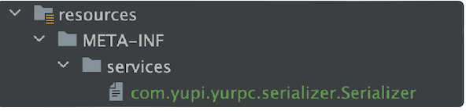

# 手写RPC框架
## RPC框架架构图


## 一、服务消费者、提供者定义

### 1.1 提供者
1. 定义UserService接口的具体方法实现
2. 启动web服务器，这里使用Vertx，也可以使用Tomcat
   - Web服务器的作用是接收http请求，并根据body中的信息从注册器中获取Service实现类，调用其中的方法，并封装方法调用的返回值，最后响应HTTP请求
```java
public class ProviderMain {

    public static void main(String[] args) {

        //服务启动时将服务注册到注册器中
        LocalRegistry.register(UserService.class.getName(), UserServiceImpl.class);

        VertxHttpServer vertxHttpServer = new VertxHttpServer();

        vertxHttpServer.doStart(8088);

    }
}
```

### 1.2 消费者
1. 消费者正常调用方法，如同调用本地方法一样即可，但要注意，Service接口要放在common包中，被消费者和提供者共用
```java
public class ConsumerMain {
    public static void main(String[] args) {

        //获取UserServiceImpl示例
        UserService userService = ServiceProxyFactory.getProxy(UserService.class);

        User user = userService.getUser("ZunF");
        if (user == null) {
            System.out.println("user == null");
        } else {
            System.out.println(user);
        }
    }
}
```
## 二、RPC框架
### 2.1 序列化器
代理对象和Web服务器之间的交互，其中的数据需要先进行序列化（转化为byte数组），才能够在网络上传输。
#### 2.1.1 序列化器接口
```java
 public interface Serializer {

    /**
     * 序列化
     * @param object 需要序列化的对象
     * @return 序列化结果
     * @param <T> 需要进行序列化的类
     * @throws IOException IO异常
     */
    <T> byte[] serialize(T object) throws IOException;


    /**
     * 反序列化
     * @param bytes 序列化byte数组
     * @param type 反序列化的目标类Class对象
     * @return 反序列化的结果
     * @param <T> 反序列化的目标类型
     * @throws IOException IO异常
     */
    <T> T deserialize(byte[] bytes, Class<T> type) throws IOException;
}
```
#### 2.1.2 Jdk序列化器
```java
public class JdkSerializer implements Serializer {
    /**
     * 序列化
     *
     * @param object 需要序列化的对象
     * @param <T>    需要进行序列化的类，注意，这个类需要实现Serializable接口
     * @return 序列化结果
     * @throws IOException IO异常
     */
    @Override
    public <T> byte[] serialize(T object) throws IOException {
        ByteArrayOutputStream byteArrayOutputStream = new ByteArrayOutputStream();
        ObjectOutputStream objectOutputStream = new ObjectOutputStream(byteArrayOutputStream);
        objectOutputStream.writeObject(object);
        objectOutputStream.close();
        return byteArrayOutputStream.toByteArray();
    }

    /**
     * 反序列化
     *
     * @param bytes 序列化byte数组
     * @param type  反序列化的目标类Class对象
     * @param <T>   反序列化的目标类型，注意，这个类需要实现Serializable接口
     * @return 反序列化的结果
     * @throws IOException IO异常
     */
    @Override
    public <T> T deserialize(byte[] bytes, Class<T> type) throws IOException {
        ByteArrayInputStream byteArrayInputStream = new ByteArrayInputStream(bytes);
        ObjectInputStream objectInputStream = new ObjectInputStream(byteArrayInputStream);
        try {
            return (T) objectInputStream.readObject();
        } catch (Exception e) {
            throw new RuntimeException(e);
        } finally {
            objectInputStream.close();
        }
    }
}
```

### 2.2 Web服务器
用于服务提供者启动，接收请求
```java
public class VertxHttpServer implements HttpServer {
    @Override
    public void doStart(int port) {
        //创建 Vert.x 实例
        Vertx vertx = Vertx.vertx();

        //创建 HTTP 服务器
        io.vertx.core.http.HttpServer server = vertx.createHttpServer();

        //设置请求的处理器
        server.requestHandler(new VertxHttpServerHandler());

        //启动 HTTP 服务器并监听指定端口
        server.listen(port, result -> {
            if (result.succeeded()) {
                System.out.println("Server is now listening on port " + port);
            } else {
                System.out.println("Failed to start server: " + result.cause());
            }
        });
    }
}
```

### 2.3 代理工厂、代理类
用于创建代理对象，向Web服务器发送网络请求，调用服务提供者的代码，并处理方法返回值，让用户无感地远程调用方法
#### 2.3.1 代理工厂
```java
public class ServiceProxyFactory {


    public static <T> T getProxy(Class<T> clazz) {
        return (T) Proxy.newProxyInstance(clazz.getClassLoader(), new Class[]{clazz}, new ServiceProxy());
    }

}
```

#### 2.3.2 代理类
```java
public class ServiceProxy implements InvocationHandler {


    @Override
    public Object invoke(Object proxy, Method method, Object[] args) throws Throwable {

        Serializer serializer = new JdkSerializer();

        //构造请求参数
        RpcRequest request = RpcRequest.builder()
                .serviceName(method.getDeclaringClass().getName())
                .methodName(method.getName())
                .paramTypes(method.getParameterTypes())
                .params(args)
                .build();

        try {
            byte[] bytes = serializer.serialize(request);
            //发送请求
            try (HttpResponse httpResponse = HttpRequest
                    .post("http://localhost:8088")
                    .body(bytes).execute()){

                //处理接口执行结果并返回
                byte[] result = httpResponse.bodyBytes();
                //反序列化
                RpcResponse rpcResponse = serializer.deserialize(result, RpcResponse.class);
                return rpcResponse.getData();

            }

        } catch (Exception e) {
            e.printStackTrace();
        }

        return null;
    }
}
```
## 三、全局配置化
1. 可以利用Properties类对指定的.properties文件进行读取，读取的结果是一个类似于Map的数据类型，通过key就能够获取到value。
```properties
# application.properties  
app.name=My Application  
app.version=1.0.0  
server.port=8080
```
```java
public class PropertiesDemo {  
  
    public static void main(String[] args) {  
        Properties properties = new Properties();  
  
        try (FileInputStream fis = new FileInputStream("src/main/resources/application.properties")) {  
            // 从输入流中加载属性列表  
            properties.load(fis);  
  
            // 读取并打印属性  
            String appName = properties.getProperty("app.name");  
            String appVersion = properties.getProperty("app.version");  
            String serverPort = properties.getProperty("server.port");  
  
            System.out.println("App Name: " + appName);  
            System.out.println("App Version: " + appVersion);  
            System.out.println("Server Port: " + serverPort);  
  
        } catch (IOException e) {  
            e.printStackTrace();  
        }  
    }  
}
```
2. 利用第三方工具类，例如Hutools的Props，这种封装过的工具类会更加方便
3. 想要读取.yaml文件，Properties是不行的，得引入第三方工具类

## 四、创建Mock数据
- 也就是模拟数据，当服务提供端并没有搭建好时，服务消费者想要跑通流程，就需要要用到Mock数据，用来模拟服务提供端的行为
1. 消费者配置类添加一个配置项：
```java
    /**
     * 是否使用模拟数据
     */
    private boolean isMock = false;
```
2. 代理工厂中判断是否开启模拟数据，开启了就用模拟数据代理类来代理对象
```java
if (RpcApplication.getRpcConsumerConfig().isMock()) {
        return (T) Proxy.newProxyInstance(clazz.getClassLoader()
                                          , new Class[]{clazz}, new MockServiceProxy());
}
```
3. 如果开启了就根据方法返回类型返回默认值
```java
public class MockServiceProxy implements InvocationHandler {

    @Override
    public Object invoke(Object proxy, Method method, Object[] args) throws Throwable {
        //根据方法的返回值类型，返回特定数值
        Class<?> returnType = method.getReturnType();
        if (returnType.isPrimitive()) {
            if (returnType == boolean.class) {
                return false;
            } else if (returnType == byte.class) {
                return (byte) 0;
            } else if (returnType == short.class) {
                return (short) 0;
            } else if (returnType == int.class) {
                return 0;
            } else if (returnType == long.class) {
                return 0L;
            } else if (returnType == float.class) {
                return 0F;
            } else if (returnType == double.class) {
                return 0D;
            } else if (returnType == char.class) {
                return (char) 0;
            } else if (returnType == void.class) {
                return null;
            }
        }
        return null;
    }
}
```

## 五、序列化器与SPI机制
### 5.1 主流序列化方式对比
**1）JSON**

优点：

- 可读性强
- 跨语言支持广泛

缺点：

- 序列化后数据量相对较大
- 不能很好地处理复杂的数据结构和循环引用

**2）Hession**

优点：

- 二进制序列化，序列化后数据量较小
- 支持跨语言，适用于分布式系统间的调用

缺点：

- 性能相对JSON略低，因为要将对象转换成二进制格式
- 对象必须实现Serializable接口

**3）kryo**

优点：

- 高性能，序列化和反序列化速度快
- 支持循环引用和自定义序列化器，适用于复杂的对象结构
- 无需对象实现Serializable接口

缺点：

- 只适用于Java
- 序列化格式不易读懂，不便于调试

**4）Protobuf**

优点：

- 高效的二进制序列化，序列化后数据极小
- 支持跨语言，并提供了多种语言的实现库

缺点：

- 配置十分麻烦
- 序列化格式不易读懂，不便于调试


### 5.2 SPI机制

SPI（Service Provider Inteface）服务提供者接口，主要用于实现模块化开发和插件化扩展。

SPI机制允许服务提供者通过特定的配置流程，将自己的实现注册到系统中，然后通过反射机制动态地加载这些实现，而不需要修改源码，从而实现解耦、提高了可扩展性。

#### 5.2.1 系统实现SPI机制

Java内已经实现了SPI机制的相关接口，可以直接使用：

1）首先在`resource`资源目录下创建`META-INF/service`目录，并创建一个命名为：要实现的接口全类名的空文件

 

2）在文件中填写需要自己定制的接口实现类的全类名

 

3）直接使用系统内置的 `ServiceLoader` 动态加载指定接口的实现类，代码如下：

```java
// 指定序列化器
Serializer serializer = null;
ServiceLoader<Serializer> serviceLoader = ServiceLoader.load(Serializer.class);
for (Serializer service : serviceLoader) {
	serializer = service;
}
```

#### 5.2.2 自定义实现SPI机制


